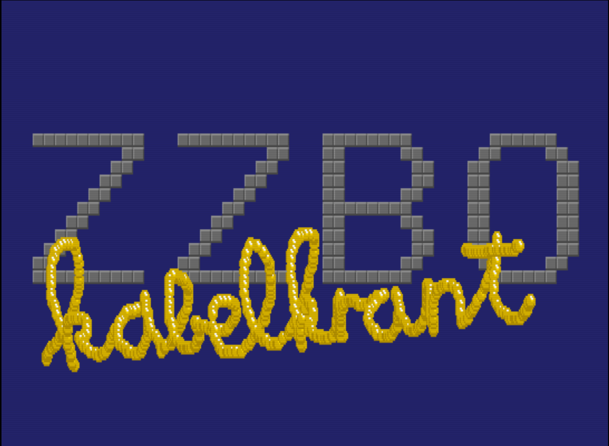
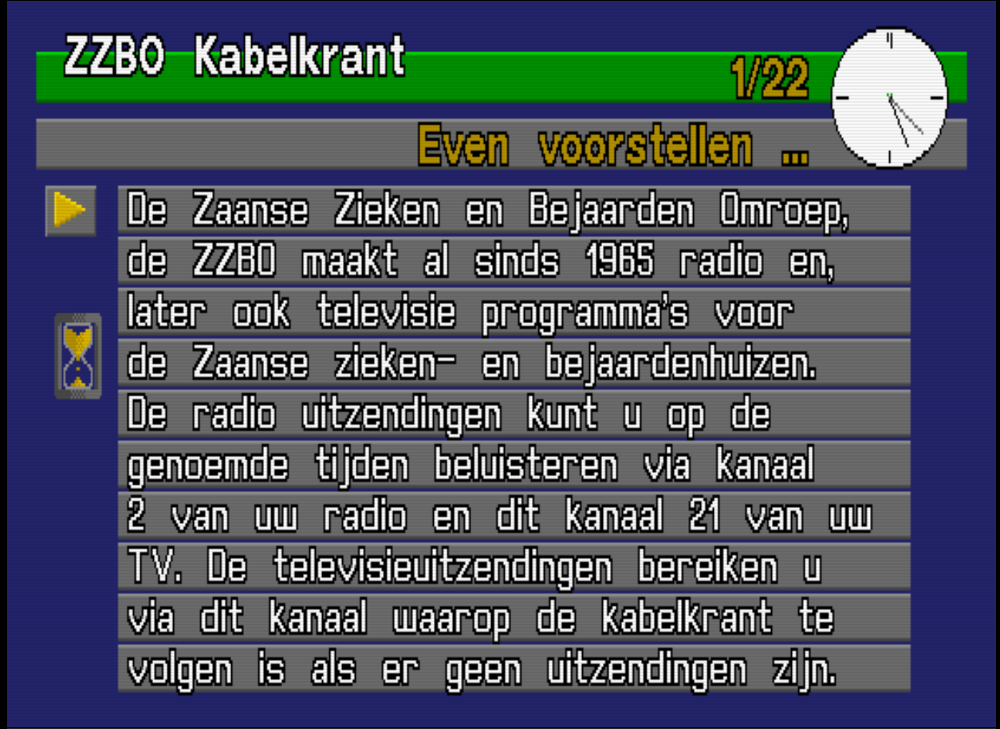
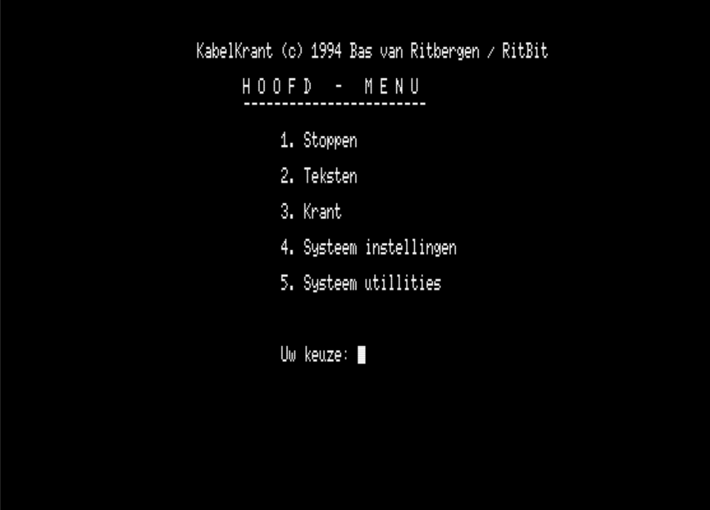
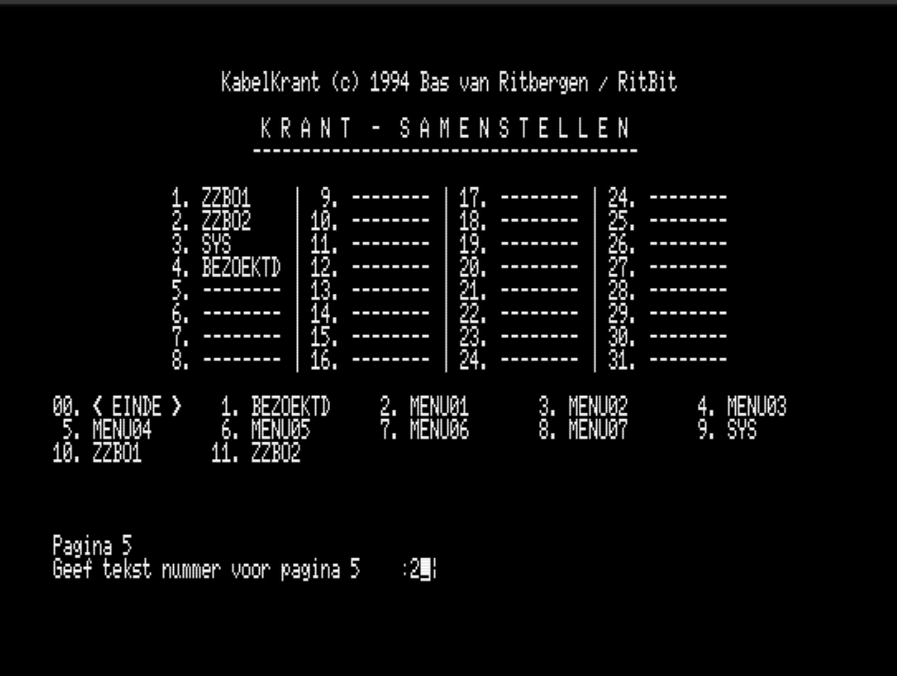
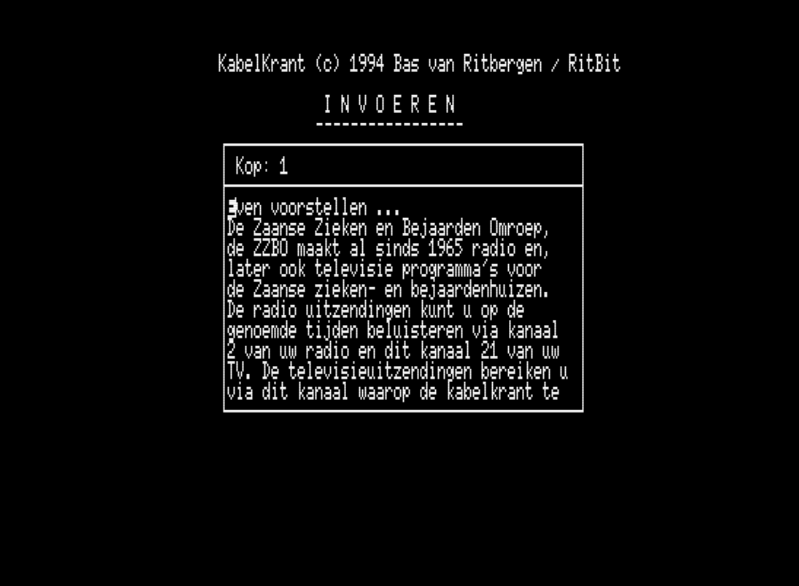
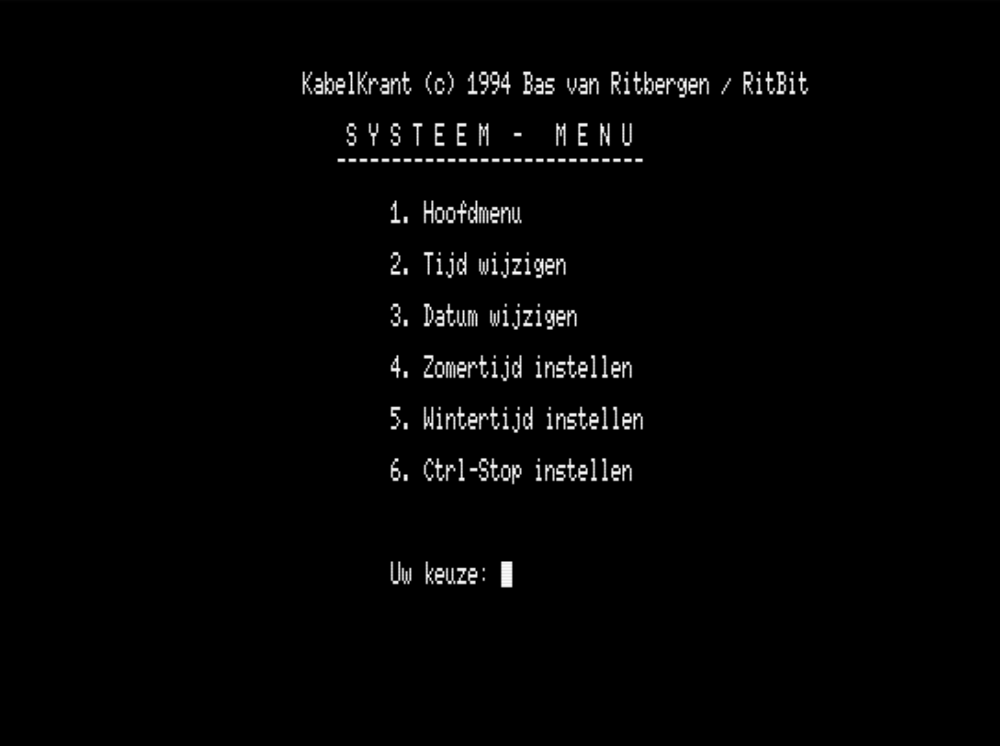
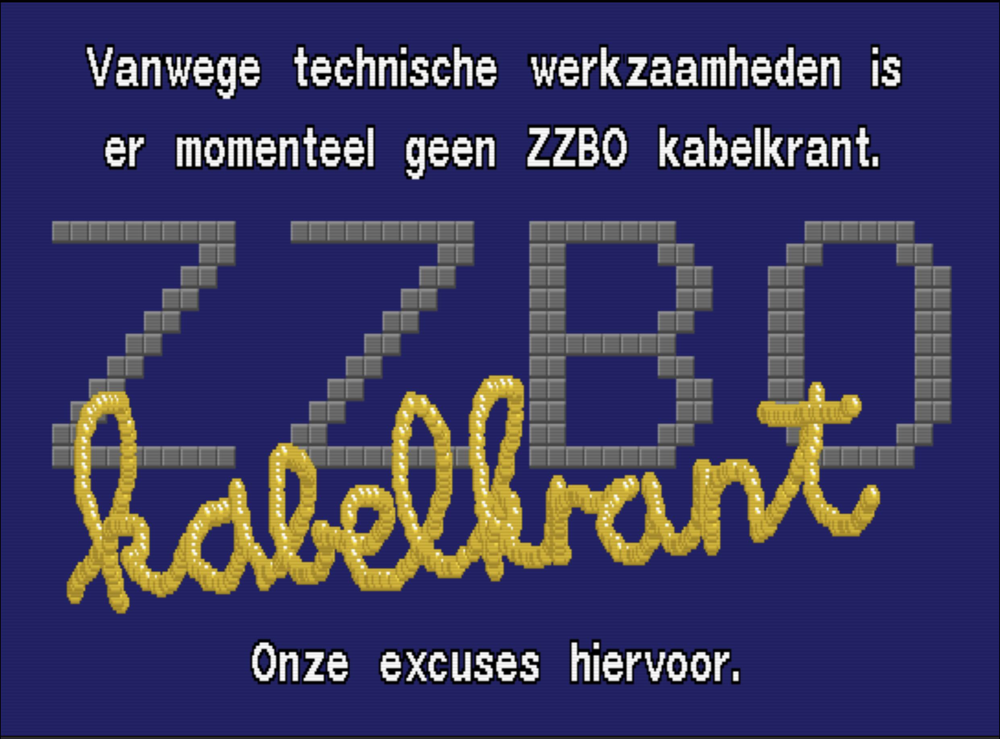
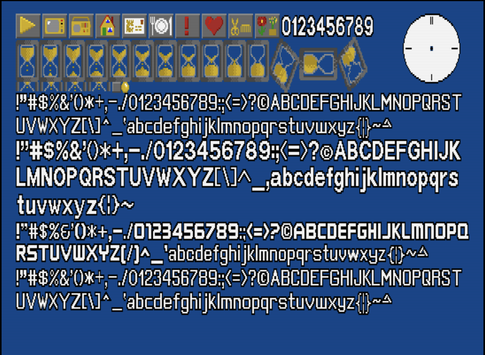

# ZZBO Kabelkrant — MSX2 Cable Television Bulletin System (1994)



You can see it working with a live demo here via the [WebMSX emulator](https://webmsx.org/?MACHINE=MSX2E&DISK=https://raw.githubusercontent.com/Ritbit/MSX-Kabelkrant/main/assets/kabelkrant-6.2.dsk)

This repository preserves the source code of the **Kabelkrant**, a digital information bulletin system built in the early 1990s for **[ZZBO](https://nl.wikipedia.org/wiki/ZZBO)** — the *Zaanse Zieken en Bejaarden Omroep*, a local radio & television broadcaster serving care facilities in the Zaanstreek region of the Netherlands.

The system ran unattended on a **Philips NMS-8250 MSX2** computer, displaying rotating information pages — visiting hours, daily menus, announcements, and local news — on the internal cable TV channel, visible in hospital rooms and public areas.

The software is written almost entirely in **MSX BASIC**, with a small Z80 assembly RAM disk driver to keep page loading fast. It ran in production for several years.

The version published here is **version 6.2 (1994)**. Two earlier generations are preserved in `archive/`, older versions did not survive the years unfortunately.

# Why and a bit of history

In the late 80's and early 90's, the ZZBO, a local broadcaster serving care facilities in the Zaanstreek region, wanted to provide digital information to their viewers in the hospital rooms and public areas of the main hospital ziekenhuis de Heel in Zaandam. I (as an enthusiast 18 year old in 1990), was already experimenting with developing news-bulletin systems myself on my home-computer and so I suggested they could use a simple home-computer and I would make a program that could display rotating information pages on the internal cable TV channel. I built the Kabelkrant system on a Philips NMS-8250 MSX2 computer, which ran unattended and displayed pages like visiting hours, daily menus, announcements, and local news. The system was a success and ran in production for several years up to 1999!

The first editions where merely static code an no page-maintenance system existed and it was basic text only.
Later editions added a graphical page which highly increased the font quality. From version 4 I started to implement a BBS function so editors could dial in and edit content remotely, that was used for a couple of months but later they decided it was easier to have copies of the system on disks, edit that at home or in the studio and just swap the disks in the system onsite. the latest version with modem support was 5.3x as we removed all modem support in version 5.40 to never return.

The final version was version 6 where the some bugfixes were done in 6.2 which is the version as shown here and discussed in the documentation. The older version 5.3x and 5.44 are in /archive/ for reference.

Over the years there were some ideas to let the system control video players so they could automate programs to be started automatically by that was never actually implemented, like switching the video output via the tape-cassette motor control, some remnants of that are still in the code as MOTOR ON and MOTOR OFF but were never actually used.

---

## Screenshots

### Live information display



*A live information page. SCREEN 7 graphical rendering, proportional font, animated analog clock, hourglass, page counter, and a day-of-week rotating header.*

### Operator interface

| Main menu | Page schedule editor |
|---|---|
|  |  |
| Operator main menu (SCREEN 0 text mode) | Compose the daily broadcast order |

| Text editor | System settings |
|---|---|
|  |  |
| Built-in text editor for page content | Clock, date, Ctrl-Stop |

### Fault display and asset sheet

| Fault screen | Graphics asset sheet |
|---|---|
|  |  |
| Displayed when the service is interrupted | KRANT4.SC7: icons, hourglass frames, 4 font styles |

See [docs/SCREENSHOTS.md](docs/SCREENSHOTS.md) for the full screenshot gallery.

---

## Why this is interesting

A small home computer solving a real broadcast problem:

- **Proportional graphical font** rendered in SCREEN 7 via VDP `COPY` blits — not BASIC `PRINT`
- **Right-aligned text** using a scratch-line render-then-measure trick
- **14 animated wipe transitions** between pages, written in BASIC `LINE` loops
- **Analog clock** driven by an MSX BASIC interval timer with precomputed hand coordinates
- **RAM disk** (`RAMDISK.BIN`, Z80 assembly) as drive `C:` to avoid floppy reads during live display
- **Unattended operation** — boots, loads assets, and cycles continuously without operator input
- Earlier versions (v5.3x) also included a **dial-up BBS** so editors could call in over a modem to update content

Although modest by modern standards, it solved a real communication problem with consumer home-computer hardware.

---

## Repository layout

```text
.
├── README.md
├── LICENSE
├── CONTRIBUTING.md
├── CHANGELOG.md
├── src/                            # Version 6.2 source (MSX BASIC)
├── archive/
│   ├── 5.3x/                       # Earliest preserved version (~1990, BBS era)
│   └── 5.44/                       # Intermediate version (removed modem support)
└── docs/
    ├── HISTORY.md                  # Project history and broadcaster context
    ├── HARDWARE.md                 # Philips NMS-8250 and MSX2 hardware
    ├── SYSTEM-OVERVIEW.md          # Runtime concept and data flow
    ├── BOOT-PROCESS.md             # AUTOEXEC.BAS and boot sequence
    ├── DISPLAY-ENGINE.md           # Display loop overview
    ├── RAMDISK.md                  # RAM disk usage
    ├── MEMORY-USAGE.md             # Memory layout and constraints
    ├── FILE-FORMATS.md             # KRANT.PAG, .TXT, .SC7, data files
    ├── MODULE-REFERENCE.md         # All BASIC modules with source references
    ├── OPERATOR-GUIDE.md           # Operator menus with screenshots
    ├── TECHNICAL-DETAILS.md        # USR routines, bootstrap, scratch rendering
    ├── LIMITATIONS.md              # Performance and capacity constraints
    ├── ARCHITECTURE.md             # High-level architecture with Mermaid diagrams
    ├── PAGE-FORMAT.md              # Page schedule and content file formats
    ├── RENDERING.md                # Complete rendering pipeline (deep dive)
    ├── SCREEN-LAYOUT.md            # SCREEN 7 coordinate zones
    ├── SCREENSHOTS.md              # Screenshot gallery
    ├── THE-SYSTEM.md               # Narrative: viewers, operators, daily workflow
    ├── VERSION-HISTORY.md          # Version history (v5.3x, v5.44, v6.2)
    ├── MSX_CHARACTER_MAP_TABLE.md  # MSX character set reference
    ├── SOFTWARE-OVERVIEW.md        # System overview
    └── internal/                   # Source-driven module documentation
        ├── BOOT.md
        ├── INITIALISATION.md
        ├── DISPLAY-LOOP.md
        ├── OPERATOR-MENUS.md
        ├── PAGE-MANAGER.md
        ├── TEXT-ENGINE.md
        └── RAMDISK-USAGE.md
```

---

## Documentation

**Start here:**

- [History](docs/HISTORY.md) — why this was built, for whom, and how it evolved
- [The system in use](docs/THE-SYSTEM.md) — viewers, operators, a typical broadcast day
- [Hardware](docs/HARDWARE.md) — the Philips NMS-8250 MSX2 platform
- [Architecture](docs/ARCHITECTURE.md) — module layers and data flow

**Technical deep dives:**

- [Rendering engine](docs/RENDERING.md) — proportional fonts, right-alignment trick, wipe effects, clock
- [Screen layout](docs/SCREEN-LAYOUT.md) — SCREEN 7 coordinate zones and VRAM page map
- [Technical details](docs/TECHNICAL-DETAILS.md) — USR routines, bootstrap trick, interrupt management
- [Memory usage](docs/MEMORY-USAGE.md) — Z80 address space, BASIC heap, RAM disk trade-off
- [Page format](docs/PAGE-FORMAT.md) — KRANT.PAG schedule and .TXT content files
- [File formats](docs/FILE-FORMATS.md) — all data file structures
- [Module reference](docs/MODULE-REFERENCE.md) — every BASIC module documented
- [Limitations](docs/LIMITATIONS.md) — capacity limits and maintainability constraints

**Source-level documentation** (in `docs/internal/`):

- [Boot sequence](docs/internal/BOOT.md)
- [Initialisation](docs/internal/INITIALISATION.md)
- [Display loop](docs/internal/DISPLAY-LOOP.md)
- [Operator menus](docs/internal/OPERATOR-MENUS.md)

---

## Running the system

The software requires an MSX2 environment with two floppy drives (A: and B:) and the RAM disk installed on C:.

Recommended emulators:

- **[openMSX](https://openmsx.org/)** — accurate MSX2 emulation, supports floppy disk images
- **[WebMSX](https://webmsx.org/)** — runs in the browser

The source files must be placed on an MSX-DOS disk image with the correct layout. See [docs/SYSTEM-OVERVIEW.md](docs/SYSTEM-OVERVIEW.md) for the runtime requirements.

Easier is to download the [.dsk](https://github.com/Ritbit/MSX-Kabelkrant/raw/refs/heads/main/assets/kabelkrant-6.2.dsk) disk-image for running on an MSX2-emulator or even a physical machine!

Or you can download a [zip-archive](https://github.com/Ritbit/MSX-Kabelkrant/raw/refs/heads/main/assets/kabelkrant-6.2.zip) with all the files in a ascii/readable format

---

## Status

Historical archive. The code is published for preservation, curiosity, and retro-computing interest.

It may not run unmodified on every MSX2 emulator without reconstructing the original disk layout.

---

## License

Released under the **GNU General Public License v3.0 or later**. See [LICENSE](LICENSE).
