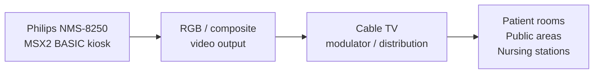

# Hardware

## The Philips NMS-8250

The deployment machine was a **[Philips NMS-8250](https://www.msx.org/wiki/Philips_NMS_8250)**, a Dutch-made MSX2 computer.

Philips was the dominant MSX manufacturer in Western Europe, and the NMS-8250 was their mid-range MSX2 model. In the Netherlands, MSX remained popular well into the early 1990s, and Philips machines were widely available in consumer electronics stores.

### CPU

The NMS-8250 runs a **Zilog Z80A** (or compatible) CPU at **3.58 MHz**.

All software in this project is written in MSX BASIC, which is interpreted by the Z80. The only compiled Z80 binary is `RAMDISK.BIN` — a 2 KB RAM disk driver that executes directly.

The interpreter overhead is relevant to performance: every BASIC statement, every `COPY` command, every loop iteration, passes through the Z80 at 3.58 MHz. The rendering engine is designed around this constraint.

### Video: Yamaha V9938

The video display processor is the **[Yamaha V9938](https://www.msx.org/wiki/Yamaha_V9938)**, also known as the MSX-Video chip.

The V9938 has its own **128 KB of VRAM**, separate from the main CPU RAM. This allows the CPU and VDP to operate concurrently on their respective memories.

Key V9938 capabilities used by the Kabelkrant:

| Feature | How it is used |
|---|---|
| SCREEN 7 (512×212, 16 colours from 512) | Live information display mode |
| Multiple VRAM pages | Page 0 = visible output; page 1 = font/asset store and scratch area |
| Hardware `COPY` command (VDP-to-VDP blit) | Glyph rendering, icon placement, wipe transitions |
| `TPSET` transparent copy | Transparent glyph blitting over background |
| `LINE` and `BF` fill commands | Drawing colour bars, title strips, wipe effects |
| Vertical scroll register (`VDP(24)`) | Screen clear via scroll during wipes |
| Palette registers | 16-colour palette from 9-bit RGB (3 bits per channel) |
| Sprite layer | Disabled during normal operation |

The V9938's hardware blitter is the key to the Kabelkrant's graphics performance. `COPY` operations move data entirely within VRAM without CPU involvement, which is the only way to achieve acceptable rendering speed from interpreted BASIC.

See [MSX.org: V9938](https://www.msx.org/wiki/Yamaha_V9938) for the full VDP documentation.

### RAM

The NMS-8250 has **128 KB of main RAM** (DRAM).

MSX2 memory is managed through a slot/page mapper system. In practice, the MSX BASIC interpreter occupies a significant portion of the address space, leaving a limited amount for program text, variables, arrays, and string storage.

The RAM disk driver (`RAMDISK.BIN`) consumes a portion of the upper RAM to simulate drive `C:`. This reduces the memory available to BASIC but eliminates floppy disk reads during live display.

### Storage

The NMS-8250 has **two built-in 3.5" floppy disk drives** (720 KB capacity each).

Drive A: holds the main program disk (source files, page data, graphics assets).  
Drive B: is used for backup or alternative content in some configurations.  
Drive C: is the RAM disk — a virtual drive backed by system RAM.

The floppy drives are the slowest component in the system. A single floppy read under MSX-DOS takes tens of milliseconds. The RAM disk strategy exists entirely to avoid these delays during the live broadcast loop.

### Video output

The NMS-8250 provides:

- **RGB output** (SCART connector on European models)
- **Composite video output**

Either output is suitable for connection to a cable TV modulator or local distribution system. No scan converter or special interface was required — the MSX2 output directly matched what a television system could accept.

---

## System role

In normal operation, the NMS-8250 was not used as a desktop computer. It was an **unattended broadcast appliance**:

The machine booted automatically from floppy, loaded its RAM disk, started the display loop, and ran continuously. The only human interaction was the periodic operator session to update page content.

---

## Why this hardware fits the job

| Requirement | How the NMS-8250 met it |
|---|---|
| Unattended operation | MSX BASIC `AUTOEXEC.BAS` boots automatically |
| Television output | Native composite/RGB output, no conversion needed |
| Affordability | Consumer market pricing, no industrial hardware required |
| Sufficient graphics | V9938 SCREEN 7: 512×212 resolution, hardware blitter |
| Programmability | MSX BASIC available on ROM, no OS installation needed |
| Local availability | Philips was the dominant MSX brand in the Netherlands |

---

## External references

- [MSX.org: Philips NMS 8250](https://www.msx.org/wiki/Philips_NMS_8250)
- [MSX.org: MSX2](https://www.msx.org/wiki/MSX2)
- [MSX.org: Yamaha V9938](https://www.msx.org/wiki/Yamaha_V9938)
- [MSX.org: SCREEN 7](https://www.msx.org/wiki/SCREEN_7)
- [MSX.org: MSX BASIC](https://www.msx.org/wiki/MSX_BASIC)
