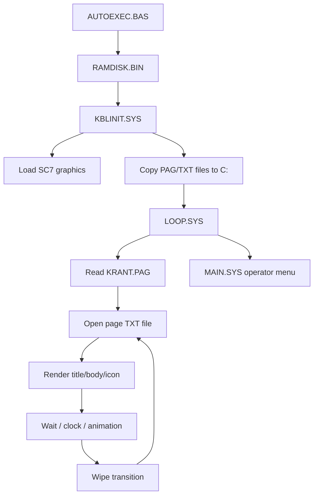

# System Overview

The software is an MSX BASIC application with a small Z80 RAM-disk binary.

It cycles through information pages built from simple `.TXT` files and schedule data. Graphics and font data are stored as MSX2 SCREEN 7 VRAM dumps.

## Live display


A live information page: proportional graphical font, analog clock, hourglass animation, page counter, and icon pictogram — all rendered in SCREEN 7 (512×212) via V9938 hardware `COPY` blits.

## Runtime overview



## Example page file

`BEZOEKTD.TXT` demonstrates the page content structure:

```text
1
Bezoektijden
Voor de meeste afdelingen gelden de
volgende bezoektijden: 's middags van
13:30 tot 14:00 uur en 's avonds van
18:00 tot 19:30 uur.

Voor een aantal afdelingen gelden af-
wijkende bezoektijden. Vraag op deze
afdelingen het verplegend personeel
naar de exacte bezoektijden.
```

Line 1 (`1`) selects the first icon (arrow/general). Line 2 is the page title. Lines 3–12 are body text.

## Graphics asset sheet

All fonts and icons are stored in `KRANT4.SC7`, loaded into VRAM page 1 at startup.


Contents: 10 page-type pictograms, hourglass animation frames, and four proportional font styles.

See [SCREENSHOTS.md](SCREENSHOTS.md) for the full gallery and [RENDERING.md](RENDERING.md) for the complete rendering pipeline.
