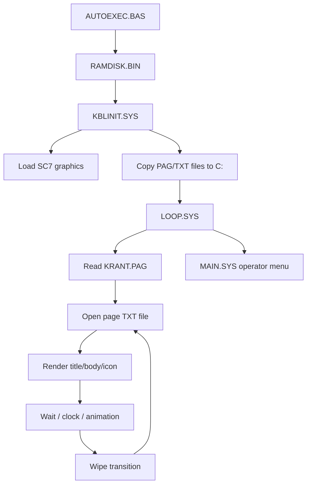

# System Overview

The software is an MSX BASIC application with a small Z80 RAM-disk binary.

It cycles through information pages built from simple `.TXT` files and schedule data. Graphics and font data are stored as MSX2 SCREEN 7 VRAM dumps.

## Runtime overview



## Example page file

`BEZOEKTD.TXT` demonstrates the page content structure:

```text
1
Bezoektijden
Voor de meeste afdelingen gelden de
volgende bezoektijden: 's middags van
13:30 tot 14:00 uur en 's avonds van
18:00 tot 19:30 uur.

Voor een aantal afdelingen gelden af-
wijkende bezoektijden. Vraag op deze
afdelingen het verplegend personeel
naar de exacte bezoektijden.
```
