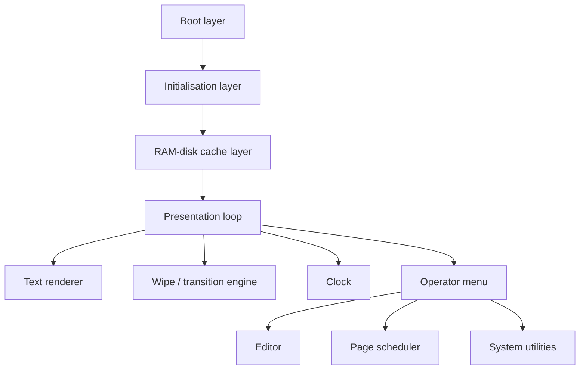

# Architecture

The system is split into small BASIC modules. Each module is loaded with `RUN` when needed rather than keeping one large monolithic BASIC program resident.

## Main architectural layers

## Important design choices

- Use RAM disk drive `C:` to avoid repeated floppy reads during live display.
- Store page content as normal text files.
- Store page schedule separately in `KRANT.PAG`.
- Use SCREEN 7 graphics and `COPY` commands for proportional text and icons.
- Use separate BASIC modules for operator functions.
- Keep the display loop mostly autonomous and return to operator mode only on key/trigger.
