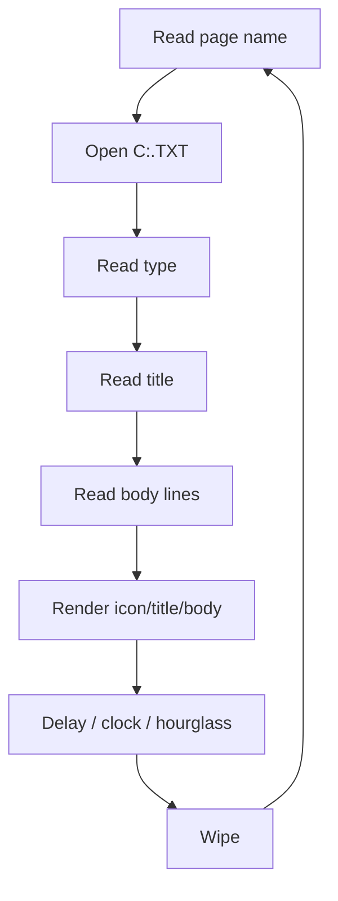

# Display Engine

The display engine is implemented entirely in `LOOP.SYS`. It runs as an infinite loop, cycling through the page schedule, rendering each page, and waiting between pages while the clock and hourglass animate.

## Selected source lines from LOOP.SYS

These are direct references to key BASIC lines that reveal the rendering pipeline:

- line 20: `' Date     : 08-07-1994              1999:Changed line 3960 to A: Drive`
- line 1130: `COPY "XK.dat" TO XK: COPY "YK.DAT" TO YK: COPY "X.DAT" TO X`
- line 1430: `OPEN "C:KRANT.PAG" AS #1 LEN=256`
- line 1610: `COPY(109,44)-(118,51),1 TO (X,Y)`
- line 1690: `COPY "INTRO2.DAT" TO "C:INTRO2.DAT"`
- line 1700: `OPEN "C:INTRO2.DAT" FOR INPUT AS #1`
- line 1780: `COPY (119,44)-(128,50),1 TO (20+X*0.14,(Y*0.13)-10),0,TPSET`
- line 1820: `KILL "C:INTRO2.DAT"`
- line 2030: `FOR A=0 TO 212: VDP(24)=A: LINE(0,A)-(512,A),0: NEXT: CLS: VDP(24)=0`
- line 2060: `COPY(435,0)-(511,44),1 TO (435,0),0,TPSET: INTERVAL ON`
- line 2290: `X=15: Y=2: LT=3: K=15: GOSUB 2500`
- line 2320: `OPEN "C:"+N$(PG)+".TXT" FOR INPUT AS #1`
- line 2345: `A$=STR$(PG+1)+"/"+PT$: X=-425: Y=9: LT=3: K=13: GOSUB 2500`
- line 2350: `LINE INPUT #1,R$: A$=USR1(R$): X=-425: Y=30: LT=3: K=13: GOSUB 2500`
- line 2390: `X=50: Y=51+((R-1)*16): LT=1: K=15 : GOSUB 2500`
- line 2450: `IF PG<32 THEN GOSUB 3100: GOSUB 3400: GOTO 2240: ' Wipe pagina & titels`
- line 2540: `LINE(0,164)-(512,212),0,BF:IF LT=1 THEN COPY(0,51)-(512,80) TO (0,164)`
- line 2640: `IF X<0 THEN COPY(X1,Y1)-(X2,Y2),1 TO (XX,190),1`
- line 2650: `IF X>=0 THEN COPY(X1,Y1)-(X2,Y2),1 TO (X+XX,Y),0,TPSET`
- line 2680: `IF X<0 THEN X=ABS(X)-XX: COPY (0,190)-(XX-1,209),1 TO (X,Y),0,TPSET`
- line 3230: `'Wipes moeten lopen van line 48 tot 212 en 0 tot 512 (256*512)`
- line 3450: `COPY(0,0)-(10,48),0 TO (A,0),0`
- line 3540: `COPY (0,0)  -(27,15),1  TO (5,50),0: GOTO 3550: ' Pijltje`
- line 3541: `COPY (28,0) -(57,15),1  TO (5,50),0: GOTO 3550: ' teeveetje`
- line 3542: `COPY (58,0) -(87,15),1  TO (5,50),0: GOTO 3550: ' Radiootje`
- line 3543: `COPY (88,0) -(117,15),1 TO (5,50),0: GOTO 3550: ' Huisje`
- line 3544: `COPY (118,0)-(147,15),1 TO (5,50),0: GOTO 3550: ' Briefje`
- line 3545: `COPY (148,0)-(177,15),1 TO (5,50),0: GOTO 3550: ' Bord en bestek`
- line 3546: `COPY (178,0)-(207,15),1 TO (5,50),0: GOTO 3550: ' Uitroepteken`
- line 3547: `COPY (208,0)-(237,15),1 TO (5,50),0: GOTO 3550: ' Hartje`
- line 3548: `COPY (238,0)-(267,15),1 TO (5,50),0: GOTO 3550: ' Schaar en kam`
- line 3549: `COPY (268,0)-(297,15),1 TO (5,50),0: GOTO 3550: ' Bloemen en planten`
- line 3550: `COPY (260,17)-(286,43),1 TO (10,90),0: ' zandloper`
- line 3610: `' Zandloper vol laten lopen.`
- line 3650: `COPY (286,16)-(319,48),1 TO (5,90),0`
- line 3680: `COPY (320,16)-(363,48),1 TO (0,90),0`
- line 3710: `COPY (364,16)-(400,48),1 TO (5,90),0`
- line 3760: `COPY (INT(A/10)*26,17)-(INT(A/10)*26+25,43),1 TO (10,90),0`
- line 3840: `FOR A =255 TO 44 STEP -1: VDP(24)=A: LINE(0,A-1)-(512,A),0,BF: NEXT`
- line 3930: `ON ERROR GOTO 3990: KILL"C:*.txt"`
- line 3960: `COPY "A:"+N$(A)+EXT$ TO "C:"+N$(A)+".txt"`
- line 4010: `SETPAGE 0,0:CLS:COPY (0,0)-(512,44) TO (0,212)`
- line 4110: `SETPAGE 0,0:CLS:COPY (0,0)-(512,44) TO (0,212):BEG=1:GOTO 10`
- line 4500: `INTERVAL OFF: CLS: BLOAD"intro.sc7",S:COLOR=RESTORE`
- line 4510: `A$="Vanwege technische werkzaamheden is ":X=30:Y=5:LT=3:K=15:GOSUB 2500`
- line 4520: `A$="er momenteel geen kabelkrant.":X=40:Y=30:LT=3:K=15:GOSUB 2500`
- line 4530: `A$="Onze excuses hiervoor.":X=120:Y=190:LT=3:K=15:GOSUB 2500`

## Responsibilities

- Read active page list from `C:KRANT.PAG`.
- Open `C:<page>.TXT` files.
- Draw the page frame/header areas.
- Render page title and body text.
- Copy icons/graphics from loaded SCREEN 7 assets.
- Draw/update the clock.
- Perform wipe transitions.
- Return to the operator menu when requested.

## Loop concept

---

## See also

- [internal/DISPLAY-LOOP.md](internal/DISPLAY-LOOP.md) — full annotated analysis of LOOP.SYS
- [RENDERING.md](RENDERING.md) — complete rendering pipeline deep dive (font, icons, wipes, clock)
- [07-TEXT-ENGINE.md](07-TEXT-ENGINE.md) — text renderer details
- [PAGE-FORMAT.md](PAGE-FORMAT.md) — KRANT.PAG and .TXT file format details
