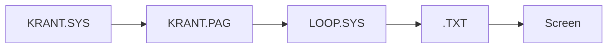

# Page Management

The system separates **page content** from **page scheduling**.

## Page content

Each page is a `.TXT` file. The observed structure is:

```text
line 1: numeric type / icon category
line 2: page title
line 3+: body lines
```

## Page schedule

`KRANT.PAG` stores the page order. The display loop reads page names from this file and opens the matching `.TXT` files.

The editor/scheduler module `KRANT.SYS` is responsible for composing and saving the page list.



## End/empty entries

The display logic recognises blank entries and marker-style entries such as `--------` as unused/end markers.
