# Operator Guide

The operator interface is the set of text-mode menus used to maintain page content, page schedules, and system settings. It is accessible during live operation and is controlled entirely from the keyboard.

## Accessing the operator interface

During the live broadcast loop, press **space** (or trigger the STOP handler) to pause the display and enter the operator menu. The system switches from SCREEN 7 (graphical display) back to SCREEN 0 (80-column text mode) and runs `MAIN.SYS`.

---

## MAIN.SYS — main menu


`MAIN.SYS` is the top-level dispatcher. It presents five options and chains to the relevant sub-module.

```text
H O O F D  -  M E N U
------------------------
  1. Stoppen
  2. Teksten
  3. Krant
  4. Systeem instellingen
  5. Systeem utillities
```

| Option | Action |
|---|---|
| 1. Stoppen | Return to the live display loop (`LOOP.SYS`) |
| 2. Teksten | Open the text editor — `TEKST.SYS` |
| 3. Krant | Open the page schedule editor — `KRANT.SYS` |
| 4. Systeem instellingen | Open system settings — `SYSTEM.SYS` |
| 5. Systeem utillities | Open utilities — `UTILS.SYS` |

Input is a single keypress (`INPUT$(1)`). All sub-modules return to `MAIN.SYS` when done.

---

## TEKST.SYS — text editor

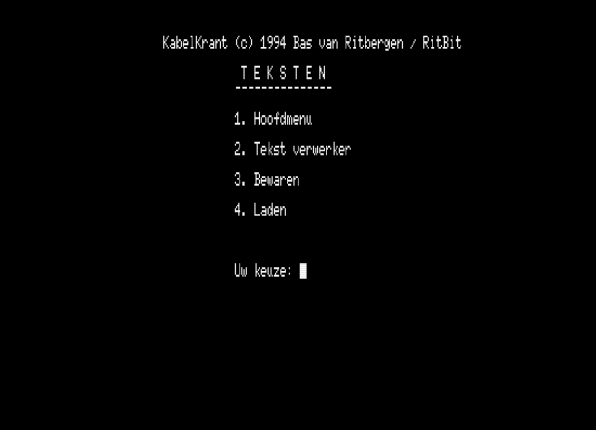

`TEKST.SYS` manages the `.TXT` page content files. Each file corresponds to one information page shown during the broadcast.

### Invoeren (enter/edit)


The full-screen text editor. A page file contains:

1. **Kop** (type number) — selects the icon pictogram displayed on the page
2. **Titel** (title) — the page heading, rendered in the larger proportional font
3. Up to **10 body lines** — displayed with the smaller proportional font

### Laden (load)

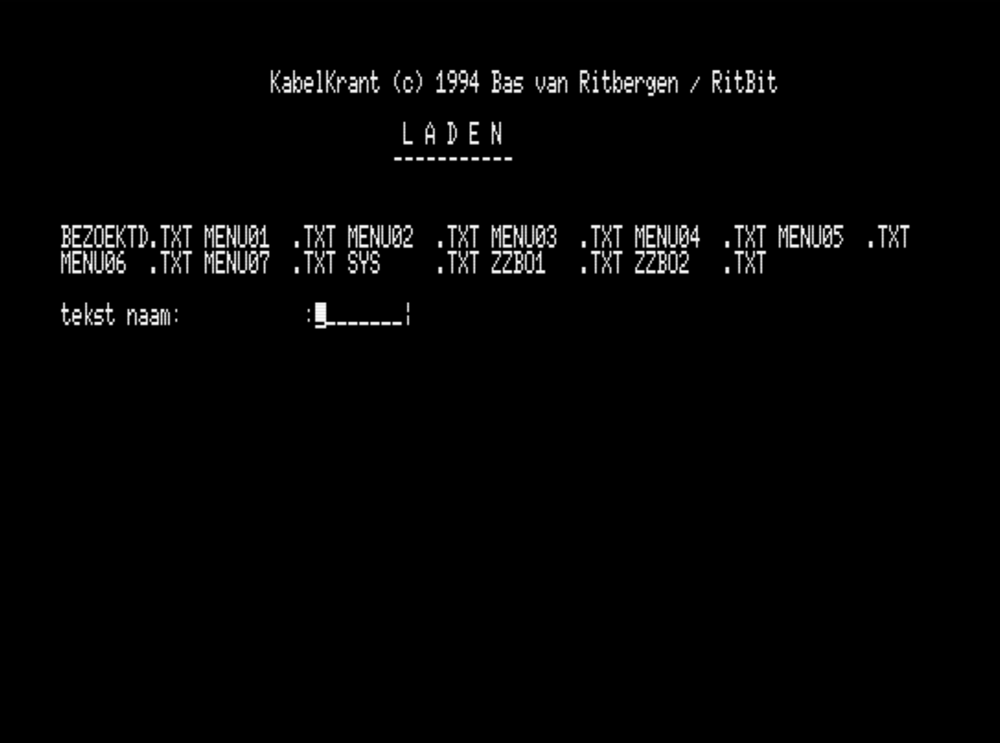

Loads an existing `.TXT` file for editing.

### Overzicht (overview)

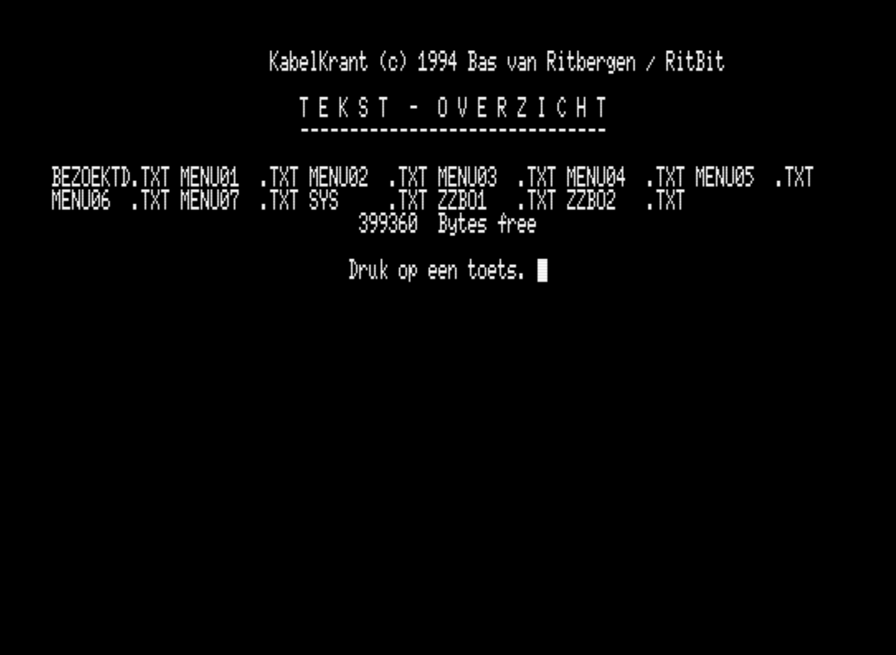

Lists all `.TXT` page files currently on the disk.

### Wissen (delete)

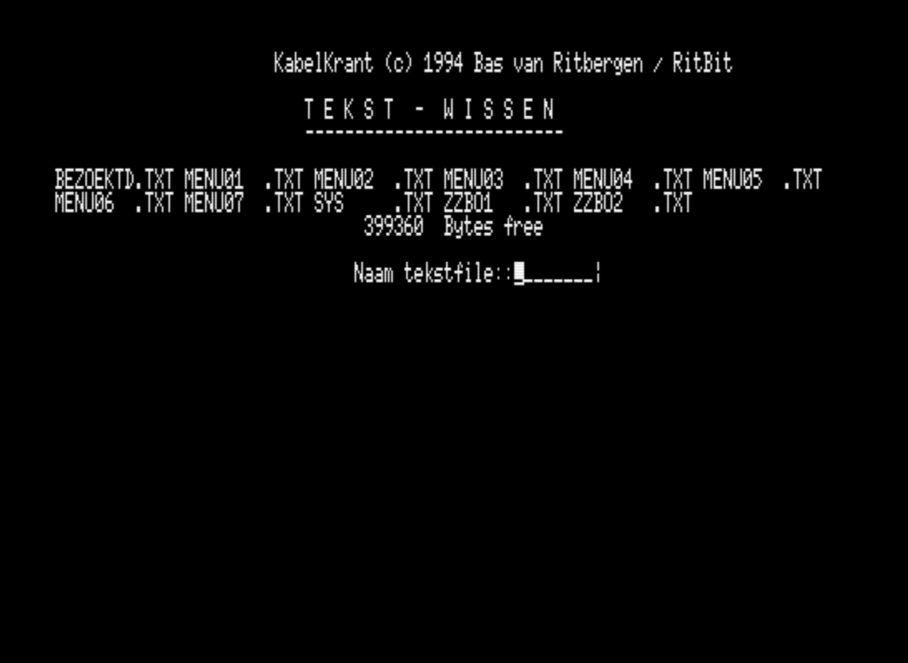

Deletes a selected `.TXT` file.

---

## KRANT.SYS — page schedule editor

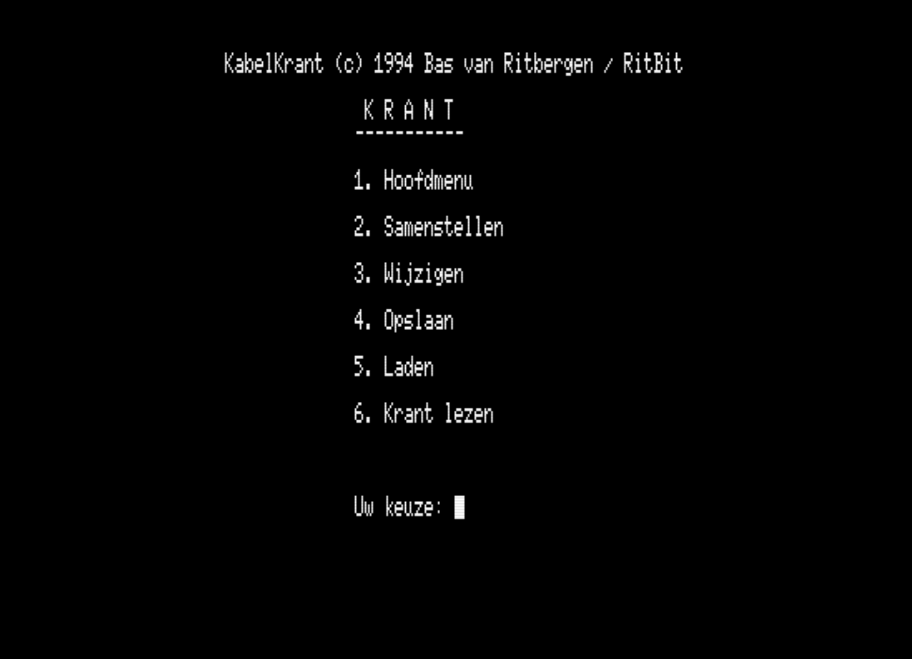

`KRANT.SYS` manages the page display schedule stored in `KRANT.PAG`. It controls which pages appear during the broadcast and in what order.

`KRANT.PAG` stores 7 day-blocks (one per weekday), each with 32 page slots of 8 bytes each.

### Samenstellen (compose)


The schedule composition screen. The upper grid shows the 32 page slots for the selected day. The lower panel lists all available page files by number. The operator types a file number at the prompt to assign it to the selected slot.

### Wijzigen (edit)

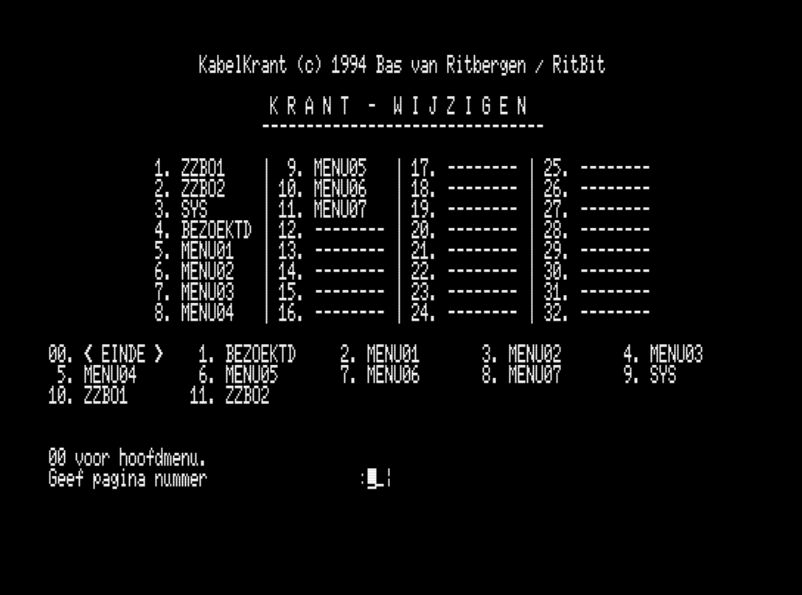

Edit an existing page schedule without full recomposition.

### Opslaan (save day)

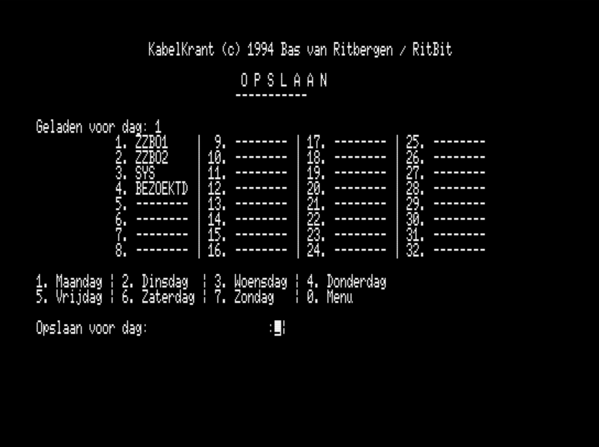

Save the edited schedule for a specific day back to `KRANT.PAG`.

### Laden (load day)

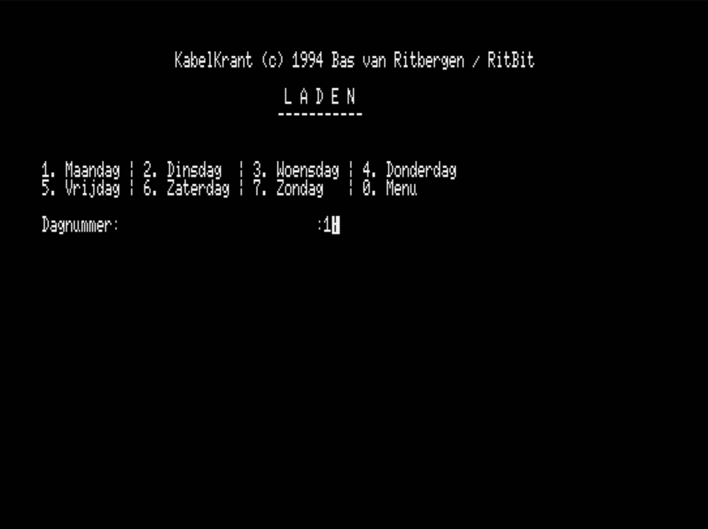

Load the schedule for a specific day from `KRANT.PAG`.

### Afsluiten (close)

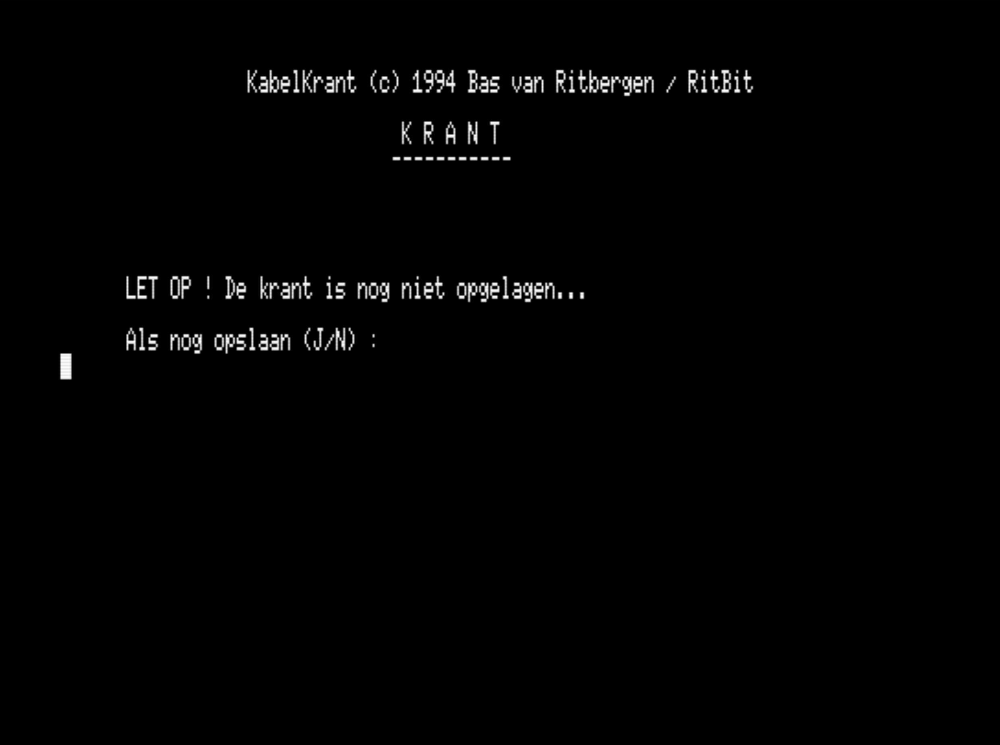

Exit the page schedule editor and return to `MAIN.SYS`.

---

## SYSTEM.SYS — system settings


`SYSTEM.SYS` handles the machine's date, time and key behaviour.

### Tijd wijzigen (change time)

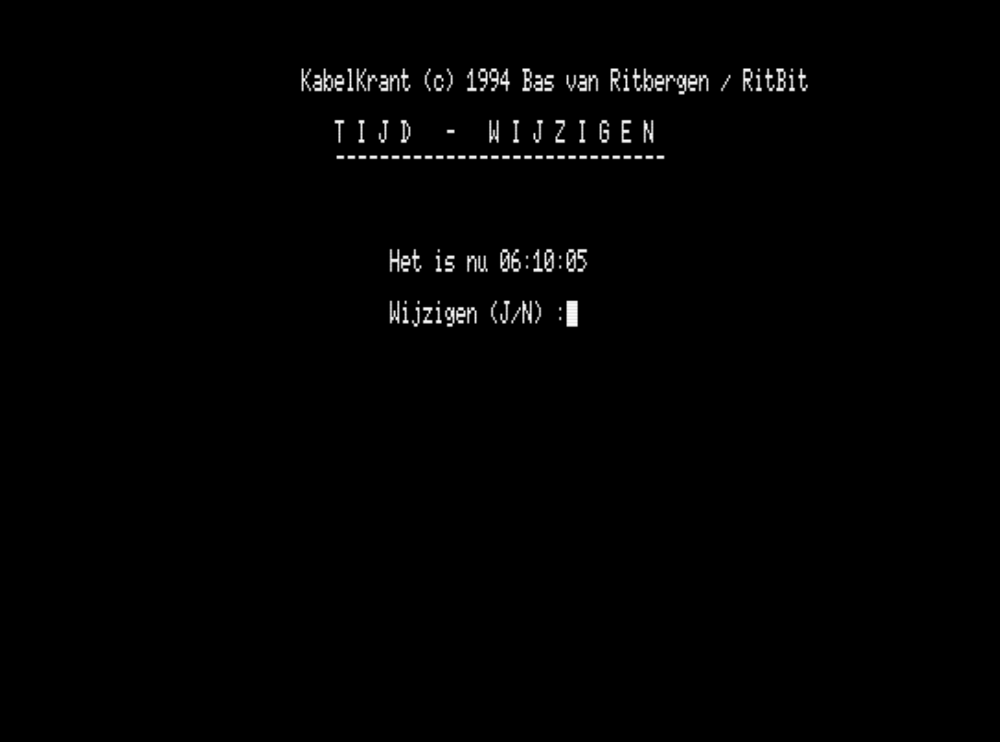

Sets the system clock using MSX BASIC `SET TIME`.

### Datum wijzigen (change date)

Sets the system date using MSX BASIC `SET DATE`.

### Zomertijd / Wintertijd (DST)

Options 4 and 5 (*Zomertijd instellen* and *Wintertijd instellen*) are listed in the menu but **not implemented**. Both route to the invalid-key handler (`GOTO 1200`) and do nothing. The DST adjustment would have had to call `GET TIME`, add or subtract one hour, and call `SET TIME` — this was apparently planned but never written.

### Ctrl-Stop instelling

Option 6 (*Ctrl-Stop instellen*) is also listed in the menu but **not implemented** — it routes to the same invalid-key handler. The intended functionality (writing 0/1 to `&HFBB1`) was never added to this module; `AUTOEXEC.BAS` handles the Ctrl-Stop lock at boot instead.

### Shared input routine

`SYSTEM.SYS` contains a reusable line-input routine at line 21000 that is also present verbatim in `UTILS.SYS`, `KRANT.SYS`, and `TEKST.SYS`. It handles backspace, Ctrl-U (clear line), and Tab, using a fixed maximum-length parameter `MA`. The `USR1` function (strip spaces) is applied to every input result at line 20030 before returning.

---

## UTILS.SYS — system utilities

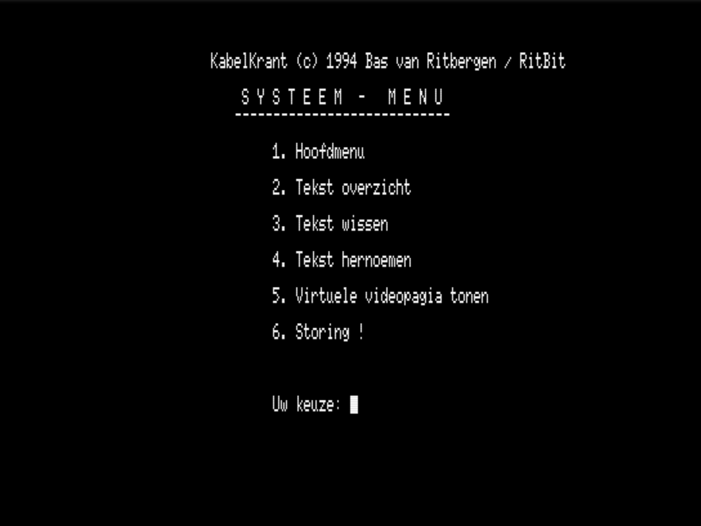

`UTILS.SYS` provides maintenance utilities.

| Option | Function |
|---|---|
| Tekst overzicht | List all `.TXT` files on the floppy with `FILES"*.TXT"` |
| Tekst wissen | Delete a selected `.TXT` file with `KILL` |
| Tekst hernoemen | Listed but **not implemented** — routes to invalid-key handler |
| Virtuele videopagina tonen | Display the contents of VRAM page 1 (font and icon asset sheet) |
| Storing! | Display the fault/maintenance screen (`STORING.SC7`) |

### Virtuele videopagina tonen

Copies VRAM page 1 to the visible display, revealing the complete `KRANT4.SC7` asset sheet — all fonts, icons, and hourglass frames. Useful for verifying the correct graphics file is loaded.

### Storing — fault screen display

Displays the `STORING.SC7` graphical maintenance screen.


The fault screen is an infinite loop (`GOTO 2640`). To exit it, the operator presses the joystick trigger button (or the equivalent keyboard key mapped to `STRIG(0)`), which fires the `ON STRIG GOSUB 2000` handler. That routine switches back to SCREEN 0 and returns to the `UTILS.SYS` menu.

The virtual video page display works the same way (`GOTO 2750` loop, same STRIG exit).

---

## PAPER.SYS and HEADER.SYS — unimplemented stubs

Two modules present in the repository were never implemented:

### PAPER.SYS

Header comment: *"Make a paper for Kabelkrant V6.0 — Save and load papers"*.

The file contains 11 lines: the standard header block and a single `ID$` string assignment. No menu, no logic. The date in the header (`31-06-1994`) is impossible — June has 30 days — suggesting it was added as a placeholder without careful attention.

`PAPER.SYS` is not referenced or called from any other module. Its intended purpose — presumably a way to compose or print a paper version of the page content — was never built.

### HEADER.SYS

The file contains 10 lines: the header template with all fields blank. No `Name`, no `Date`, no `Function`, no `Chains to`. The copyright line is present, and nothing else.

`HEADER.SYS` is also not referenced or called from anywhere.

Both files are preserved as-is in the repository as evidence of planned features that were not completed before the system went into production.

---

## Operator workflow

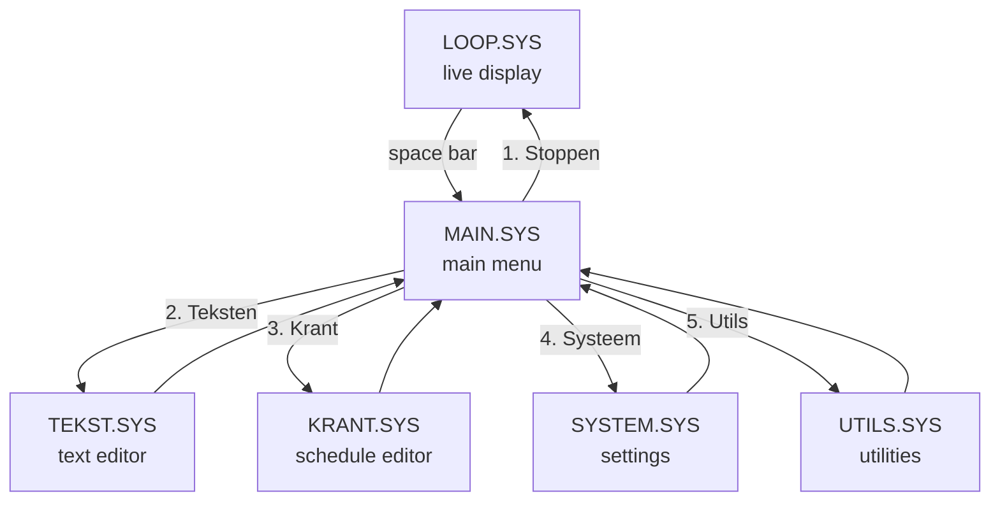

After editing page content or the schedule, the operator returns to `MAIN.SYS`, selects *Stoppen*, and the live display resumes from `LOOP.SYS`.
