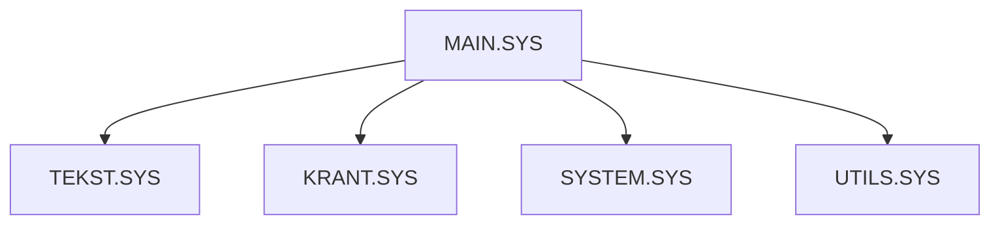

# Operator Guide

The operator interface is centered around `MAIN.SYS`.

## Main menu modules

## Text editing

`TEKST.SYS` handles editing, loading and saving text pages.

## Page scheduling

`KRANT.SYS` manages the page list/newspaper schedule stored in `KRANT.PAG`.

## System settings

`SYSTEM.SYS` contains settings such as date/time and Ctrl-Stop behaviour.

## Utilities

`UTILS.SYS` provides maintenance options such as text overview, text delete/rename, virtual video page display and fault/maintenance display.
