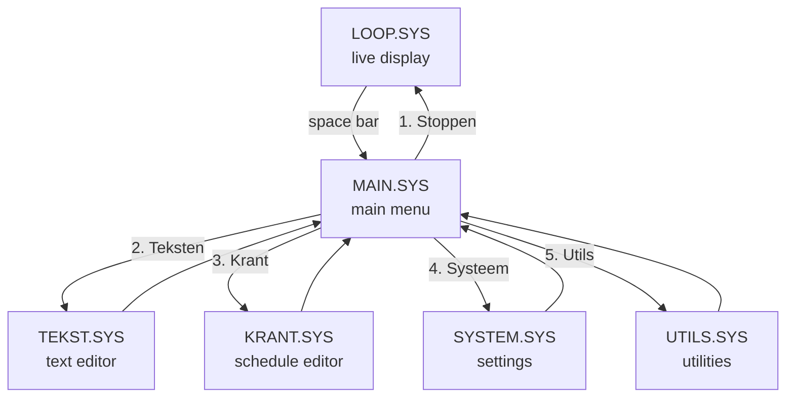

# Operator Guide

The operator interface is the set of text-mode menus used to maintain page content, page schedules, and system settings. It is accessible during live operation and is controlled entirely from the keyboard.

## Accessing the operator interface

During the live broadcast loop, press **space** (or trigger the STOP handler) to pause the display and enter the operator menu. The system switches from SCREEN 7 (graphical display) back to SCREEN 0 (80-column text mode) and runs `MAIN.SYS`.

---

## MAIN.SYS — main menu


`MAIN.SYS` is the top-level dispatcher. It presents five options and chains to the relevant sub-module.

```text
H O O F D  -  M E N U
------------------------
  1. Stoppen
  2. Teksten
  3. Krant
  4. Systeem instellingen
  5. Systeem utillities
```

| Option | Action |
|---|---|
| 1. Stoppen | Return to the live display loop (`LOOP.SYS`) |
| 2. Teksten | Open the text editor — `TEKST.SYS` |
| 3. Krant | Open the page schedule editor — `KRANT.SYS` |
| 4. Systeem instellingen | Open system settings — `SYSTEM.SYS` |
| 5. Systeem utillities | Open utilities — `UTILS.SYS` |

Input is a single keypress (`INPUT$(1)`). All sub-modules return to `MAIN.SYS` when done.

---

## TEKST.SYS — text editor


`TEKST.SYS` manages the `.TXT` page content files. Each file corresponds to one information page shown during the broadcast.

### Invoeren (enter/edit)


The full-screen text editor. A page file contains:

1. **Kop** (type number) — selects the icon pictogram displayed on the page
2. **Titel** (title) — the page heading, rendered in the larger proportional font
3. Up to **10 body lines** — displayed with the smaller proportional font

### Laden (load)


Loads an existing `.TXT` file for editing.

### Overzicht (overview)


Lists all `.TXT` page files currently on the disk.

### Wissen (delete)


Deletes a selected `.TXT` file.

---

## KRANT.SYS — page schedule editor


`KRANT.SYS` manages the page display schedule stored in `KRANT.PAG`. It controls which pages appear during the broadcast and in what order.

`KRANT.PAG` stores 7 day-blocks (one per weekday), each with 32 page slots of 8 bytes each.

### Samenstellen (compose)


The schedule composition screen. The upper grid shows the 32 page slots for the selected day. The lower panel lists all available page files by number. The operator types a file number at the prompt to assign it to the selected slot.

### Wijzigen (edit)


Edit an existing page schedule without full recomposition.

### Opslaan (save day)


Save the edited schedule for a specific day back to `KRANT.PAG`.

### Laden (load day)


Load the schedule for a specific day from `KRANT.PAG`.

### Afsluiten (close)


Exit the page schedule editor and return to `MAIN.SYS`.

---

## SYSTEM.SYS — system settings


`SYSTEM.SYS` handles the machine's date, time and key behaviour.

### Tijd wijzigen (change time)


Sets the system clock using MSX BASIC `SET TIME`.

### Datum wijzigen (change date)

Sets the system date using MSX BASIC `SET DATE`.

### Zomertijd / Wintertijd (DST)

Adjusts the clock by one hour for summer/winter time transitions.

### Ctrl-Stop instelling

Enables or disables the Ctrl-Stop key by writing to the MSX system memory address `&HFBB1`.

---

## UTILS.SYS — system utilities


`UTILS.SYS` provides maintenance utilities.

| Option | Function |
|---|---|
| Tekst overzicht | List all `.TXT` files |
| Tekst wissen | Delete a `.TXT` file |
| Tekst hernoemen | Rename a `.TXT` file |
| Virtuele videopagina tonen | Display the contents of VRAM page 1 (font and icon asset sheet) |
| Storing! | Display the fault/maintenance screen (`STORING.SC7`) |

### Virtuele videopagina tonen

Copies VRAM page 1 to the visible display, revealing the complete `KRANT4.SC7` asset sheet — all fonts, icons, and hourglass frames. Useful for verifying the correct graphics file is loaded.

### Storing — fault screen display

Displays the `STORING.SC7` graphical maintenance screen.


---

## Operator workflow



After editing page content or the schedule, the operator returns to `MAIN.SYS`, selects *Stoppen*, and the live display resumes from `LOOP.SYS`.
