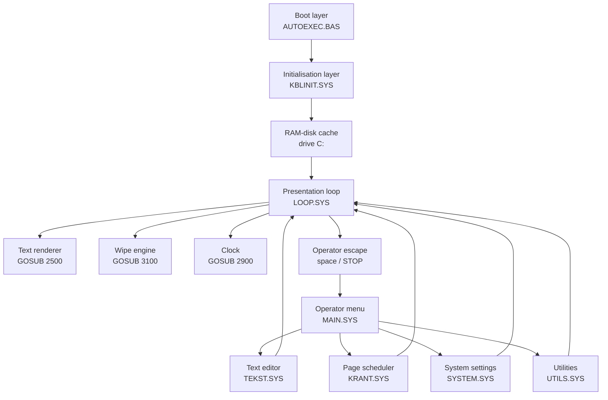
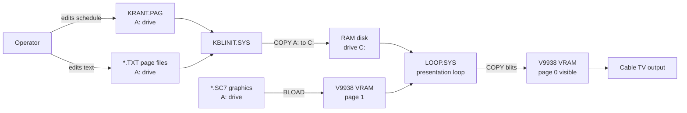

# Architecture

This document gives a high-level technical view of Kabelkrant-MSX2 version 6.2.

---

## Design constraints

The system was written for MSX2-era hardware with specific and well-understood constraints:

- **Z80 at 3.58 MHz** — all BASIC code is interpreted; no JIT, no compiler
- **128 KB main RAM** — shared by BASIC interpreter, program, variables, arrays, file buffers, and the RAM disk
- **128 KB VRAM** — V9938 video memory, separate from CPU RAM
- **Floppy disk latency** — a single sequential read can take 50–200 ms; intolerable for a live display
- **Unattended operation** — must boot, run, and recover from errors without a human
- **Television-readable output** — SCREEN 7 (512×212) on an MSX composite/RGB signal fed to a cable TV modulator

Every design decision in the software follows from these constraints.

---

## Software layers



---

## Module responsibilities

| Module | Role | Source |
|---|---|---|
| `AUTOEXEC.BAS` | Boot: install RAM disk, chain to KBLINIT | `src/AUTOEXEC.BAS` |
| `RAMDISK.BIN` | Z80 binary: installs drive C: in RAM | `src/RAMDISK.BIN` |
| `KBLINIT.SYS` | Init: load graphics, install USR routines, populate C: | `src/KBLINIT.SYS` |
| `LOOP.SYS` | Presentation engine: render pages, clock, wipes | `src/LOOP.SYS` |
| `MAIN.SYS` | Operator menu dispatcher | `src/MAIN.SYS` |
| `TEKST.SYS` | Text editor for `.TXT` page files | `src/TEKST.SYS` |
| `KRANT.SYS` | Page schedule editor for `KRANT.PAG` | `src/KRANT.SYS` |
| `SYSTEM.SYS` | Date, time, Ctrl-Stop settings | `src/SYSTEM.SYS` |
| `UTILS.SYS` | Text overview, delete, rename, virtual page view | `src/UTILS.SYS` |

---

## Data flow



Key insight: after initialisation, the live display loop reads **only from drive C: (RAM disk) and VRAM**. The physical floppy is not accessed during normal page cycling.

---

## Startup sequence

```mermaid
sequenceDiagram
    participant BIOS as MSX BIOS
    participant AUTO as AUTOEXEC.BAS
    participant BIN  as RAMDISK.BIN
    participant INIT as KBLINIT.SYS
    participant LOOP as LOOP.SYS

    BIOS->>AUTO: boot AUTOEXEC.BAS
    AUTO->>AUTO: inject RUN"KBLINIT.SYS" into keyboard buffer
    AUTO->>BIN: BLOAD "RAMDISK.BIN",R
    BIN-->>BIOS: returns, drive C: now active
    BIOS->>INIT: executes buffered RUN command
    INIT->>INIT: load INTRO.SC7 to VRAM page 1
    INIT->>INIT: load KRANT4.SC7 to VRAM page 1
    INIT->>INIT: poke USR routine bytecodes
    INIT->>INIT: COPY *.PAG + *.TXT from A: to C:
    INIT->>LOOP: RUN "LOOP.SYS"
    LOOP->>LOOP: cycle through pages indefinitely
```

The keyboard-buffer trick in `AUTOEXEC.BAS` is the most unusual part: the program injects its own continuation command into the MSX input buffer **before** loading the binary. After `RAMDISK.BIN` returns control to BASIC, BASIC replays the buffered command and runs `KBLINIT.SYS` automatically.

See [internal/BOOT.md](internal/BOOT.md) for the annotated source analysis.

---

## Memory layout

| Area | Content |
|---|---|
| BIOS / BASIC ROM | MSX BASIC interpreter (ROM) |
| Main RAM (lower) | BASIC program text, variables, arrays, file buffers |
| Main RAM (upper) | RAM disk (drive C:) contents |
| VRAM page 0 | Live display output — what the TV sees |
| VRAM page 1 | Graphics assets (fonts, icons, hourglass), scratch area |

The RAM disk and BASIC program compete for main RAM. `CLEAR 2000` in `KBLINIT.SYS` reserves 2000 bytes of string space; `CLEAR 5000` in operator modules reserves 5000 bytes.

See [09-MEMORY-USAGE.md](09-MEMORY-USAGE.md) for more detail.

---

## Key design decisions

### 1. Modules loaded with `RUN`, not `CHAIN`

Each BASIC module (`MAIN.SYS`, `TEKST.SYS`, etc.) is loaded fresh with `RUN "module"`. Variables are not preserved between modules. This keeps each module independent but means the operator menus and the display loop cannot share runtime state.

### 2. RAM disk as the I/O bottleneck solution

Rather than optimising floppy reads, the design avoids them entirely during live display. All page data is copied to the RAM disk at startup. The display loop never touches the floppy during normal operation.

### 3. VRAM page split

The V9938 supports multiple VRAM pages. The system uses:

- Page 0: the visible output surface
- Page 1: storage for pre-loaded graphics assets and the font glyph sheet

Glyphs and icons are blitted from page 1 to page 0 via hardware `COPY` — the fastest rendering path available in MSX BASIC.

### 4. Interval timer for the clock

The clock is updated by an MSX BASIC `INTERVAL` handler registered at startup. This allows the clock hands to move even while the page content is being rendered. Critical rendering sections disable the interval temporarily with `INTERVAL OFF`.

### 5. Global variables as function parameters

The text renderer (`GOSUB 2500`) uses global variables (`A$`, `X`, `Y`, `LT`, `K`) as implicit parameters. This is standard MSX BASIC practice and avoids the overhead of string concatenation or array passing.

---

## Related documentation

- [Software overview](SOFTWARE-OVERVIEW.md) — runtime responsibilities at a glance
- [Rendering engine](RENDERING.md) — full rendering pipeline deep dive
- [Page format](PAGE-FORMAT.md) — KRANT.PAG and .TXT file formats
- [Module reference](11-MODULE-REFERENCE.md) — all modules with source line references
- [internal/BOOT.md](internal/BOOT.md) — AUTOEXEC.BAS boot analysis
- [internal/INITIALISATION.md](internal/INITIALISATION.md) — KBLINIT.SYS analysis
- [internal/DISPLAY-LOOP.md](internal/DISPLAY-LOOP.md) — LOOP.SYS analysis
