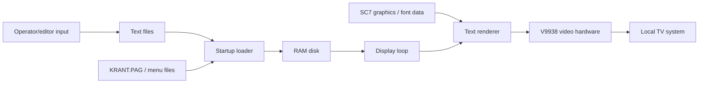

# Architecture

This document gives a high-level technical view of Kabelkrant-MSX2.

## Design constraints

The system was written for MSX2-era hardware with limited memory and relatively slow disk access.

Important constraints:

- MSX BASIC interpreter overhead
- limited directly usable RAM
- V9938 video memory model
- disk access latency
- need for unattended operation
- television-readable graphics

## Main data flow



## Startup flow

```mermaid
sequenceDiagram
    participant BASIC as MSX BASIC
    participant Init as KBLINIT
    participant RAM as RAMDISK.BIN
    participant Loop as LOOP.SYS
    participant VDP as V9938

    BASIC->>Init: Start from AUTOEXEC.BAS
    Init->>RAM: Load/install RAM disk support
    Init->>VDP: Load screen graphics
    Init->>RAM: Copy text/page data
    Init->>Loop: Start display loop
    Loop->>VDP: Render pages and transitions
```

## Core modules

### Startup

The startup logic prepares the environment, loads screen assets and sets up the RAM disk.

### RAM disk

The RAM disk is used as a speed optimization. Instead of repeatedly loading page text from slower storage, page data is copied into a memory-backed drive.

### Display loop

The display loop reads page definitions, renders page text and advances through the information pages.

### Renderer

The renderer is responsible for drawing proportional text using graphical font data.

### Wipes and transitions

The system includes visual page transitions. These are part of the on-screen identity of the bulletin system but are relatively expensive in BASIC.

## Notes

This architecture reflects the original BASIC implementation and should be refined as the source is documented in more detail.
