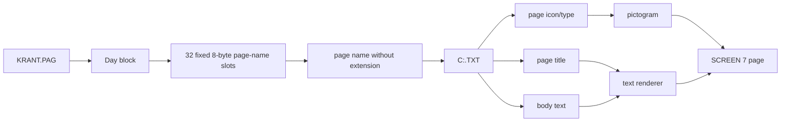
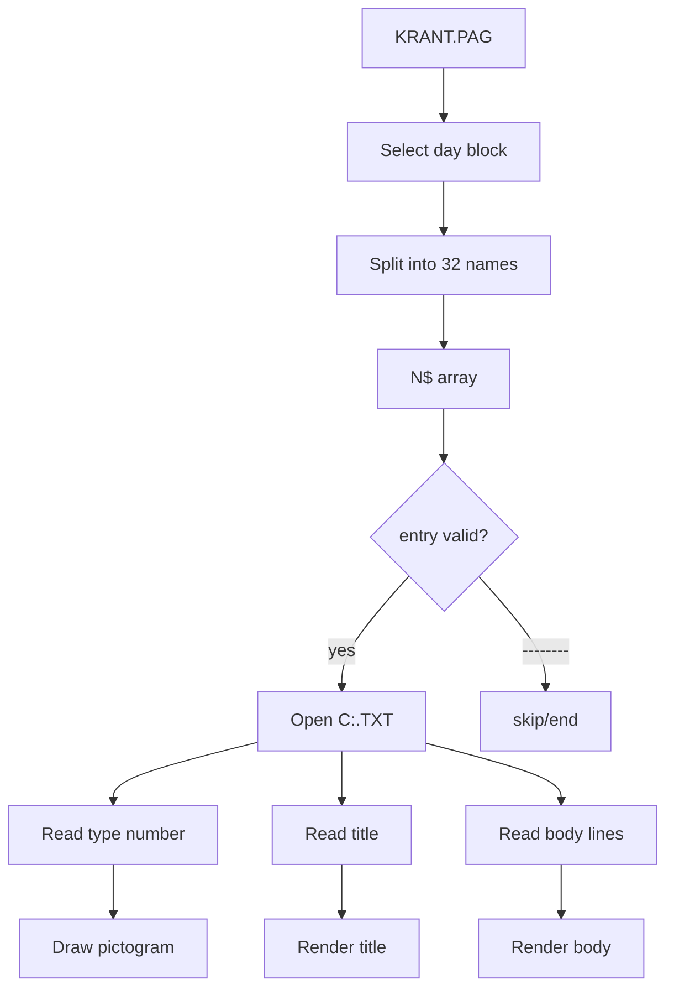

# Page Format

This document describes how the original MSX-Kabelkrant stores and displays page content.

There are two main page-related formats:

1. `KRANT.PAG` — the display schedule.
2. `*.TXT` — individual page content files.

The display loop uses `KRANT.PAG` to decide *which* pages to show, then opens each referenced `.TXT` file to render the actual content.

---

## 1. Overview



`KRANT.PAG` contains the page order. The `.TXT` files contain the actual page text.

---

## 2. Page text files

Page text files are plain text files.

Their structure is:

```text
type-number for the page icon
title
body line 1
body line 2
...
body line 10
```

Example:

```text
1
Bezoektijden
Voor de meeste afdelingen gelden de
volgende bezoektijden: 's middags van
13:30 tot 14:00 uur en 's avonds van
18:00 tot 19:30 uur.

Voor een aantal afdelingen gelden af-
wijkende bezoektijden. Vraag op deze
afdelingen het verplegend personeel
naar de exacte bezoektijden.
```

The first line is not normal body text. It is a numeric page/icon type.

The second line is the page title.

The following lines are rendered as body text. The screen layout reserves ten body lines.

---

## 3. `KRANT.PAG`

`KRANT.PAG` contains the list of pages to show.

It is divided into **seven blocks** and 256 bytes filler data, one block for each day of the week.

Each block contains a maximum of **32 page entries**.

Each page entry is exactly **8 bytes**.

There are no newline characters or separators between entries. The next filename starts immediately after the previous 8-byte field.

```text
KRANT.PAG

+------------------+
| Monday block     | 32 × 8 bytes = 256 bytes
+------------------+
| Tuesday block    | 32 × 8 bytes = 256 bytes
+------------------+
| Wednesday block  | 32 × 8 bytes = 256 bytes
+------------------+
| Thursday block   | 32 × 8 bytes = 256 bytes
+------------------+
| Friday block     | 32 × 8 bytes = 256 bytes
+------------------+
| Saturday block   | 32 × 8 bytes = 256 bytes
+------------------+
| Sunday block     | 32 × 8 bytes = 256 bytes
+------------------+
```

Total size:

```text
7 × 32 × 8 = 1792 bytes + filler data (32 x 8 =256 bytes) = 2048 bytes
```

---

## 4. Page-name entries

Each entry is an 8-byte filename stem.

The `.TXT` extension is not stored in `KRANT.PAG`.

For example:

```text
BEZOEKTD
```

means:

```text
BEZOEKTD.TXT
```

Shorter names are padded with spaces.

Examples:

```text
ZZBO1   
POST    
SYS     
MENU01  
```

This matches the MSX-DOS 8.3 filename style.

---

## 5. End / empty entries

When all pages for a day have been listed, the remaining slots are filled with eight dashes:

```text
--------
```

This fills the rest of the 32-entry block.

Example:

```text
ZZBO1   
ZZBO2   
TOTAAL  
...
MENU01  
SYS     
--------
--------
--------
...
```

The display loop treats `--------` as an end/empty marker and does not display it as a page.

---

## 6. Example block

A day block can contain entries like:

```text
 1  ZZBO1
 2  ZZBO2
 3  TOTAAL
 4  TOTAAL41
 5  ENQUETE
 6  TOTAAL42
 7  OPROEPSY
 8  TOTAAL43
 9  PATSERV
10  TOTAAL44
11  POST
12  TOTAAL45
13  TELEFOON
14  BEZOEKTD
15  TOTAAL46
16  OECUDIEN
17  TOTAAL47
18  GEESZORG
19  KERK
20  WANDELEN
21  MENU01
22  SYS
23  --------
24  --------
...
32  --------
```

The next day block follows immediately after this 256-byte block.

---

## 7. Relationship with the BASIC code

The BASIC code opens `KRANT.PAG` as a fixed-length random file:

```basic
OPEN "C:KRANT.PAG" AS #1 LEN=256
FIELD #1,128 AS D$,128 AS E$
```

This matches the actual block format:

```text
256-byte day block
    ├── D$ = first 128 bytes  = entries 1..16
    └── E$ = second 128 bytes = entries 17..32
```

The two-field layout is a BASIC convenience. It does not mean there are only two records or two logical page groups. It is still one 256-byte day block split into two 128-byte strings for easier processing.

The selected day block is read into memory, split into 8-byte page names, and stored in the runtime page array.

---

## 8. Runtime loading

At runtime:

1. The active day/week selector determines which 256-byte block is read.
2. The block is split into 32 page names.
3. The names are stored in `N$()`.
4. The display loop walks through `N$()`.
5. For each valid entry it opens:

```text
C:<page>.TXT
```

For example:

```text
BEZOEKTD
```

becomes:

```text
C:BEZOEKTD.TXT
```

---

## 9. Data flow



---

## 10. Why this format works well

The format is simple but effective:

- fixed 8-byte names are easy to slice in BASIC
- one 256-byte block per day maps cleanly to random file access
- 32 pages per day is enough for a local information system
- `--------` avoids needing a separate page count
- `.TXT` files remain human-editable
- the RAM disk can cache both `KRANT.PAG` and page text files

For an MSX BASIC program, this is a very practical design.

---

## 11. Notes

The `.SC7` files are separate graphics assets and are not part of the page format. They are VRAM dumps used for screens, icons, and font graphics.

`KRANT.PAG` defines page order. The `.TXT` files define page content.
