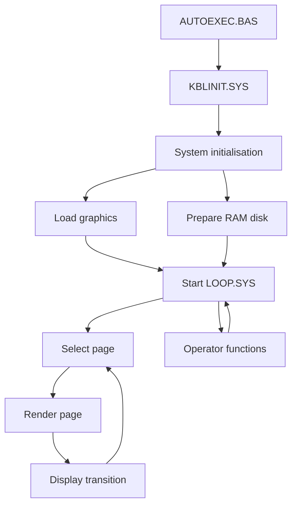

# Program Flow

The Kabelkrant software is organised as a collection of BASIC modules loaded as required.

## High-level execution

## Startup responsibilities

AUTOEXEC.BAS prepares the runtime environment and transfers control to the initialisation code.

KBLINIT.SYS prepares graphics, memory, data files and the runtime environment before entering the main display loop.

The display loop repeatedly selects, renders and presents information pages.
