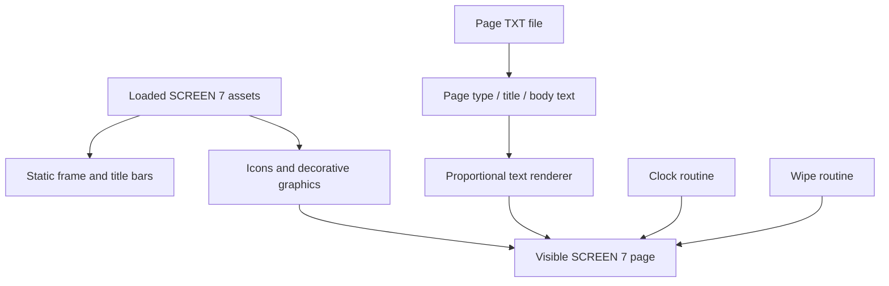
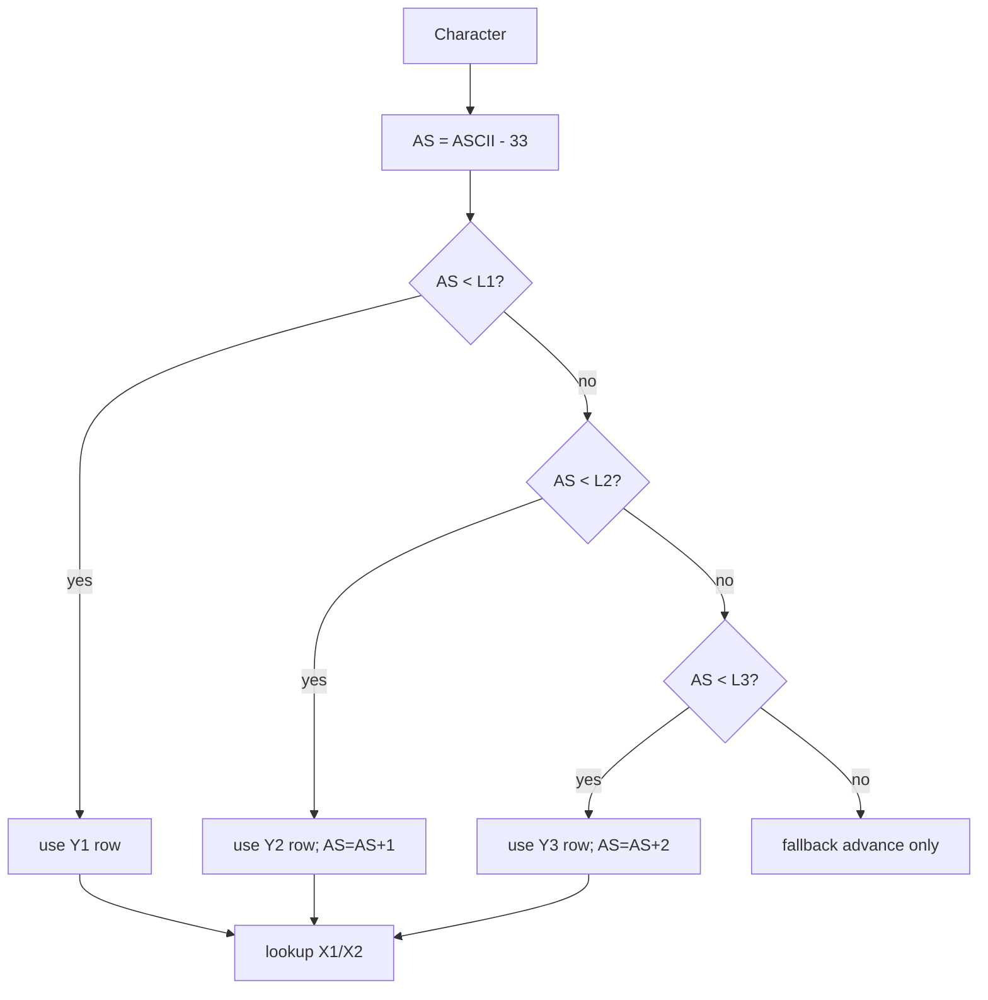

# Rendering

This document describes how the original MSX-Kabelkrant software builds and displays its graphical pages.

The most important rendering code lives in `LOOP.SYS`, especially:

- the page frame setup around lines `2000–2080`
- the page display loop around lines `2200–2450`
- the proportional text routine around lines `2500–2690`
- the font metadata loader around lines `2700–2840`
- the clock routine around lines `2900–3050`
- the wipe effects around lines `3100–3390`

The renderer is written in MSX BASIC and uses the MSX2 graphical video system directly through commands such as `SCREEN`, `SETPAGE`, `COPY`, `LINE`, `VDP()` and `INTERVAL`.

---

## 1. Rendering model

The system is not a text-mode program.

It runs as a graphical information system using MSX2 SCREEN 7 assets. Text is drawn as graphics, not printed with the standard BASIC `PRINT` command.

At runtime, a page is composed from several graphical layers:



The visible result is a television-readable information page with:

- coloured title bars
- a page number/date bar
- a page title
- an icon/pictogram
- up to ten body text lines
- an analog clock
- wipe transitions between pages

---

## 2. Screen and asset usage

The main display loop uses two important video pages:

| Page | Purpose |
|------|---------|
| page 0 | visible output page |
| page 1 | source graphics, font graphics and temporary work area |

The code explicitly switches pages during rendering:

```basic
SETPAGE 0,1
...
SETPAGE 0,0
```

The program loads graphical assets from `.SC7` files before the loop runs. These files are VRAM dumps for MSX2 SCREEN 7.

Important assets include:

| File | Purpose |
|------|---------|
| `INTRO.SC7` | intro/start screen graphics |
| `KRANT3.SC7` | screen graphics asset |
| `KRANT4.SC7` | main graphics/font/icon asset sheet |

The `.SC7` files are best understood as prepared SCREEN 7 VRAM images. This documentation does not attempt to describe the full internal V9938 VRAM dump layout.

---

## 3. Page frame

Before displaying pages, `LOOP.SYS` clears and redraws the fixed screen frame.

Relevant code around lines `2000–2080`:

```basic
2030 FOR A=0 TO 212: VDP(24)=A: LINE(0,A)-(512,A),0: NEXT: CLS: VDP(24)=0
2040 LINE(0,8)-(512,8),2: LINE(0,9)-(512,22),12,BF: LINE(0,23)-(512,23),7
2050 LINE(0,29)-(512,29),11: LINE(0,30)-(512,43),14,BF: LINE(0,44)-(512,44),3
2060 COPY(435,0)-(511,44),1 TO (435,0),0,TPSET: INTERVAL ON
```

This creates the top screen structure:

```text
+---------------------------------------------------------------+
| top title strip / date / page counter / clock graphics        |
+---------------------------------------------------------------+
| second header strip / page title                              |
+---------------------------------------------------------------+
|                                                               |
| page body area                                                |
|                                                               |
+---------------------------------------------------------------+
```

The body background is prepared separately around lines `2100–2160`:

```basic
2130 FOR A=0 TO 9: H=A*16
2140 LINE (45,50+H)-(480,50+H),11: LINE(45,51+H)-(480,63+H),14,BF
2150 LINE(45,64+H)-(480,64+H),3: NEXT
```

This draws ten horizontal grey text blocks, one for each body text line.

---

## 4. Page display loop

The page loop starts around line `2200`.

The visible page rendering sequence is:

1. determine the current page name from `N$(PG)`
2. draw the grey text blocks
3. render the top title/date line
4. open the current page text file from drive `C:`
5. read the first line as the page type/icon number
6. draw the icon/pictogram
7. render page counter and page title
8. render up to ten body lines
9. animate the hourglass
10. run a wipe before the next page

Relevant lines:

```basic
2240 IF N$(PG)="--------" OR LEFT$(N$(PG),1)=" " THEN 3800
2260 GOSUB 2100: ' Schrijf grijze blokken
2280 IF PG MOD 2=0 THEN A$="Kabelkrant" ELSE A$=DA$
2290 X=15: Y=2: LT=3: K=15: GOSUB 2500
2320 OPEN "C:"+N$(PG)+".TXT" FOR INPUT AS #1
2340 LINE INPUT #1,R$: PL=VAL(R$): GOSUB 3500
2345 A$=STR$(PG+1)+"/"+PT$: X=-425: Y=9: LT=3: K=13: GOSUB 2500
2350 LINE INPUT #1,R$: A$=USR1(R$): X=-425: Y=30: LT=3: K=13: GOSUB 2500
2360 FOR R=1 TO 10
2380    LINE INPUT #1,A$: IF A$=" " OR A$=STRING$(10,8) THEN 2400
2390    X=50: Y=51+((R-1)*16): LT=1: K=15 : GOSUB 2500
```

The `GOSUB 2500` routine is therefore used for:

| Text | Position | Style |
|------|----------|-------|
| alternating header text `"Kabelkrant"` or date | `X=15, Y=2` | `LT=3, K=15` |
| page number / total count | `X=-425, Y=9` | `LT=3, K=13` |
| page title | `X=-425, Y=30` | `LT=3, K=13` |
| body lines | `X=50, Y=51+(line*16)` | `LT=1, K=15` |

The negative `X` values are significant and are discussed in the alignment section.

---

## 5. Text renderer entry point

The proportional text renderer starts at line `2500`:

```basic
2500 '
2510 ' Afdrukken letters
2520 '
2530 INTERVAL OFF: SETPAGE 0,1
2540 LINE(0,164)-(512,212),0,BF:IF LT=1 THEN COPY(0,51)-(512,80) TO (0,164)
2550 LINE(0,164)-(512,212),K,BF,AND: SETPAGE 0,0: INTERVAL ON
2555 TL=LEN(A$): IF TL=0 THEN RETURN
2560 XX=0: TR=H(LT): FOR L=1 TO TL
...
2690 RETURN
```

The routine is entered via:

```basic
GOSUB 2500
```

It uses global variables as parameters.

| Variable | Meaning |
|----------|---------|
| `A$` | string to render |
| `X` | horizontal position; if negative, use right-alignment mode |
| `Y` | vertical destination position |
| `LT` | letter/font style index |
| `K` | colour/mask parameter |
| `XX` | accumulated rendered pixel width |
| `TL` | string length |
| `TR` | fallback advance width for missing/space characters |

This is typical MSX BASIC style: instead of passing arguments explicitly, the caller sets agreed global variables before `GOSUB`.

---

## 6. Font metadata

The font metadata is loaded by the routine around lines `2700–2840`.

```basic
2730 RESTORE 2810
2740 FOR LT=1 TO 4
2750    READ L1(LT),L2(LT),L3(LT),Y1(LT),Y2(LT),Y3(LT),H(LT)
2760 NEXT LT
```

The data table:

```basic
2810 DATA 52,96,00,164,179,000,14
2820 DATA 56,96,00,081,094,000,12
2830 DATA 43,83,96,081,098,116,16
2840 DATA 49,96,00,160,174,000,14
```

Each `LT` entry defines:

| Field | Meaning |
|-------|---------|
| `L1(LT)` | first character group boundary |
| `L2(LT)` | second character group boundary |
| `L3(LT)` | third character group boundary |
| `Y1(LT)` | source Y coordinate for group 1 |
| `Y2(LT)` | source Y coordinate for group 2 |
| `Y3(LT)` | source Y coordinate for group 3 |
| `H(LT)` | glyph height / fallback advance |

The table maps a character index to the correct row in the font graphics sheet.

The comments preserve older values:

```basic
2850 ' Oorspromkelijke regel 2810 DATA 52,96,00,051,066,000,14
2860 ' Oorspronkelijke regel 2830 DATA 43,83,96,107,124,142,16
```

This shows that the font layout or asset sheet changed at some point, and the old values were kept for reference.

---

## 7. Glyph width and X coordinate table

The renderer also uses the two-dimensional array:

```basic
X(4,110)
```

This is loaded during initialisation of `LOOP.SYS`:

```basic
1130 COPY "XK.dat" TO XK: COPY "YK.DAT" TO YK: COPY "X.DAT" TO X
```

For text rendering, `X.DAT` supplies the glyph X boundaries.

The renderer reads:

```basic
2630 X2=X(LT,AS+1)-1: X1=X(LT,AS): Y2=Y1+H(LT)
```

This means that every glyph is stored as a horizontal span in the source graphics page:

```text
source rectangle = (X1,Y1) - (X2,Y2)
```

The width is calculated as:

```text
glyph_width = X2 - X1 + 1
```

and added to the accumulated output width:

```basic
2660 XX=XX+X2-X1+1
```

This is how the system implements proportional fonts.

Each character advances by its real pixel width, not by a fixed cell width.

---

## 8. Character lookup

The renderer converts each character to a glyph index like this:

```basic
2580 AS=ASC(MID$(A$,L,1))-33: IF AS<0 THEN 2620
```

So the source font table effectively begins at ASCII code 33 (`!`).

Characters below ASCII 33, including spaces, are treated specially:

```basic
2620 XX=XX+TR: GOTO 2670
```

They do not copy a glyph. They only advance by `TR`, which is set from:

```basic
TR=H(LT)
```

So for spaces and unsupported lower characters, the fallback advance is the font height value.

This is not mathematically elegant, but in practice it gives a usable blank width without needing a separate space-width table.

---

## 9. Character group selection

After calculating the glyph index, the renderer selects the correct source row:

```basic
2590 IF AS < L1(LT) THEN Y1=Y1(LT):         GOTO 2630
2600 IF AS < L2(LT) THEN Y1=Y2(LT):AS=AS+1: GOTO 2630
2610 IF AS < L3(LT) THEN Y1=Y3(LT):AS=AS+2: GOTO 2630
2620 XX=XX+TR: GOTO 2670
```

The glyphs are stored in multiple horizontal rows in the source graphics sheet.

The `AS=AS+1` and `AS=AS+2` adjustments compensate for row transitions in the `X()` boundary table.

Conceptually:



This structure avoids a large per-character metadata table. The code only needs row limits plus an X-boundary table.

---

## 10. Direct rendering path

For normal positive `X`, glyphs are copied directly from page 1 to the visible page 0:

```basic
2650 IF X>=0 THEN COPY(X1,Y1)-(X2,Y2),1 TO (X+XX,Y),0,TPSET
```

This performs a transparent copy (`TPSET`) from the source font graphics to the visible page.

The destination X coordinate is:

```text
X + XX
```

where:

- `X` is the requested starting position
- `XX` is the accumulated width of previous characters

So the renderer walks across the line as it draws each glyph.

---

## 11. Right-aligned scratch rendering path

The renderer has a second path when `X < 0`:

```basic
2640 IF X<0 THEN COPY(X1,Y1)-(X2,Y2),1 TO (XX,190),1
...
2680 IF X<0 THEN X=ABS(X)-XX: COPY (0,190)-(XX-1,209),1 TO (X,Y),0,TPSET
```

This path is used by calls such as:

```basic
2345 A$=STR$(PG+1)+"/"+PT$: X=-425: Y=9: LT=3: K=13: GOSUB 2500
2350 LINE INPUT #1,R$: A$=USR1(R$): X=-425: Y=30: LT=3: K=13: GOSUB 2500
```

The practical meaning is:

```text
X = -425
```

means:

```text
place the right edge of the rendered string at X=425
```

It is not a request to draw at a negative screen coordinate.

### Why this exists

With proportional fonts, the renderer does not know the final pixel width until it has processed all characters.

Instead of doing a separate measurement pass, it renders the string into a scratch strip on page 1 at Y=190. While doing this, it accumulates the final width in `XX`.

After all glyphs are rendered, it calculates:

```basic
X = ABS(X) - XX
```

and copies the completed strip to the visible page.

So the algorithm is:

```mermaid
flowchart TD
    A[X < 0] --> B[render glyphs to page 1 scratch strip]
    B --> C[accumulate final width in XX]
    C --> D[calculate final X = ABS(X) - XX]
    D --> E[copy completed strip to page 0]
```

This is a clever BASIC-era trick. It combines rendering and measurement in one pass.

### Important terminology

This is not general double-buffering.

It is better described as:

> scratch-line rendering for right-aligned proportional text placement.

---

## 12. Temporary strip preparation

At the start of the renderer, page 1 area `(0,164)-(512,212)` is prepared:

```basic
2530 INTERVAL OFF: SETPAGE 0,1
2540 LINE(0,164)-(512,212),0,BF:IF LT=1 THEN COPY(0,51)-(512,80) TO (0,164)
2550 LINE(0,164)-(512,212),K,BF,AND: SETPAGE 0,0: INTERVAL ON
```

This appears to prepare the source/scratch area before rendering.

For `LT=1`, a block from `(0,51)-(512,80)` is copied to `(0,164)`. This suggests that at least one font style is copied or staged before colour masking is applied.

The following line applies an `AND` fill with colour/mask `K`.

This is one of the places where the renderer relies heavily on MSX BASIC graphics semantics and VDP page state.

---

## 13. Special handling for `LT=3`

After the character loop, the renderer does this:

```basic
2675 IF LT=3 THEN INTERVAL OFF:SETPAGE 0,1:LINE(0,164)-(512,212),K,BF,AND:SETPAGE 0,0:INTERVAL ON
```

This applies the colour/mask operation again for `LT=3`.

This may be related to how the title/header font is stored or colourised.

This document records the behaviour, but the exact original reason should be verified visually against the asset sheet and emulator output.

---

## 14. Icons and pictograms

Each page text file begins with a numeric page/icon type. During page display:

```basic
2340 LINE INPUT #1,R$: PL=VAL(R$): GOSUB 3500
```

The routine around `3500` places the hourglass and pictogram.

Relevant lines include:

```basic
3500 '
3510 ' Zandloper en pictogram plaatsen
...
```

The numeric first line of the text file is therefore not part of the visible body text. It selects a graphic used in the page header/body area.

A sample text page begins like this:

```text
1
Bezoektijden
Voor de meeste afdelingen gelden de
...
```

Here `1` is the page type, `Bezoektijden` is the page title, and the remaining lines are the body.

---

## 15. Clock rendering

The analog clock is updated by the interval routine around lines `2900–3050`.

The program registers the interval handler early in `LOOP.SYS`:

```basic
120 ON ERROR GOTO 4050: ON INTERVAL=50 GOSUB 2900: INTERVAL OFF
```

Clock coordinate arrays are loaded during initialisation:

```basic
1130 COPY "XK.dat" TO XK: COPY "YK.DAT" TO YK: COPY "X.DAT" TO X
```

The clock routine reads the current time:

```basic
2930 GET TIME T$
2940 U=VAL(LEFT$(T$,2)): IF U>11 THEN U=U-12
2950 M=VAL(MID$(T$,4,2))
2960 S=VAL(RIGHT$(T$,2))
2965 U=(U*5)+CINT(M/12)
```

Then it erases old hands and draws new ones:

```basic
2980 LINE(469,22)-(XK(UO),YK(UO)),15:UO=U
3000 LINE(469,22)-(XK(MO),YK(MO)),15:MO=M
3010 LINE(469,22)-(XK(SO),YK(SO)),15:SO=S
3020 LINE(469,22)-(XK(U),YK(U)),1
3030 LINE(469,22)-(XK(M),YK(M)),14
3040 LINE(469,22)-(XK(S),YK(S)),6
```

The centre of the clock is at approximately:

```text
(469,22)
```

The arrays `XK()` and `YK()` contain 60 precomputed endpoint coordinates for clock hand positions.

---

## 16. Wipe effects

Page transitions are implemented in BASIC around lines `3100–3390`.

The routine selects one of 14 wipe effects:

```basic
3130 A=CINT(RND(1)*15)
3140 ON A GOTO 3240,3250,3260,3270,3280,3290,3300,3310,3320,3330,3340,3350,3360,3370
```

The source comments list the intended effects:

```basic
3150 'Wipe 1: Van Boven naar Onder      Wipe 2: Van Onder naar Boven
3160 'Wipe 3: Van Links naar Rechts     Wipe 4: Van Rechts naar Links
3170 'Wipe 5: Van B en O naar Midden    Wipe 6: Van L en R naar Midden
3180 'Wipe 7: Van Midden naar B en O    Wipe 8: Van Midden naar L en R
3190 'Wipe 9: Van buiten naar binnen    Wipe 10: Van binnen naar buiten
3200 'Wipe 11: Van B naar O interlaced  Wipe 12: Van L naar R interlaced
3210 'Wipe 13: Van 2 Midden naar L en R Wipe 14: Van B naar B en omg. int.
```

The wipe region is documented in the source:

```basic
3230 'Wipes moeten lopen van line 48 tot 212 en 0 tot 512 (256*512)
```

So the wipes clear the central page body area, leaving the top header/clock area mostly intact.

The wipes use BASIC drawing loops such as:

```basic
3240 FOR A = 50 TO 212 STEP 2: LINE(0,A)-(512,A+1),0,BF: NEXT
3260 FOR A = 0 TO 512  STEP 2: LINE(A,50)-(A+1,212),0,BF: NEXT
3320 FOR A = 0 TO 256  STEP 2: Y=A/(256/75): LINE(A,Y+50)-(512-A,212-Y),0,B: ...
```

These are visually interesting but relatively slow because every step runs through interpreted BASIC.

---

## 17. Interrupt handling during rendering

The display loop uses the MSX BASIC interval timer to update the clock. Some rendering operations disable the interval temporarily:

```basic
INTERVAL OFF
...
INTERVAL ON
```

This is important because the clock routine also draws on the screen. If the clock routine interrupted a complex copy or scratch rendering operation, the result could be visually corrupted.

The text renderer disables the interval while manipulating page 1 setup and special font operations. The wipe routine also disables the interval during transition animation.

---

## 18. Performance characteristics

The rendering system makes smart use of the V9938 through BASIC `COPY` commands, but it is still constrained by interpreted BASIC.

Expensive operations include:

- per-character `MID$()` and `ASC()` calls
- multiple conditional branches per character
- table lookups for every glyph
- one VDP `COPY` per visible glyph
- wipe loops that execute many BASIC `LINE` commands
- repeated `SETPAGE` and `INTERVAL` state changes

The RAM disk reduces file I/O latency, but it does not make the renderer itself faster.

The most important rendering bottlenecks are therefore:

1. proportional text drawing
2. wipe transitions
3. clock/timer coordination
4. page composition overhead

---

## 19. Design strengths

Despite being written in BASIC, the renderer is surprisingly capable.

Notable strengths:

- graphical proportional font support
- transparent glyph blitting with `TPSET`
- right-aligned text through scratch-line rendering
- reusable font metadata tables
- page-type icons
- analog clock
- multiple wipe transitions
- separation between schedule files and page text files
- good use of RAM disk to avoid disk stalls

This is not simply "printing text on a screen". It is a small graphical presentation engine built on top of MSX BASIC.

---

## 20. Known open questions

Some details are still worth verifying with emulator screenshots and asset inspection:

1. The exact visual layout of every font row in `KRANT4.SC7`.
2. The exact reason `LT=3` reapplies the colour/mask operation after rendering.
3. The exact meaning of every `LT` style.
4. Whether every wipe path is reachable, since the random selector uses `CINT(RND(1)*15)`.
5. Whether older commented font metadata lines correspond to `KRANT3.SC7`, an earlier font sheet, or a later correction.

These should be answered by comparing source behaviour against emulator output.

---

## 21. Summary

The rendering system combines:

- SCREEN 7 graphics
- pre-rendered font graphics
- external glyph X-coordinate data
- BASIC-controlled VDP `COPY` operations
- RAM-disk-backed page loading
- scratch rendering for right-aligned proportional text
- animated page transitions
- interval-driven clock drawing

For a 1994 MSX2 BASIC program, this is a sophisticated and practical design. It trades code simplicity for visual quality and uses the V9938 as a graphics blitter wherever possible.
