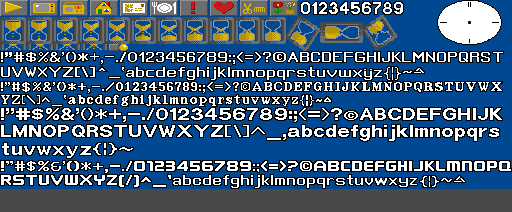
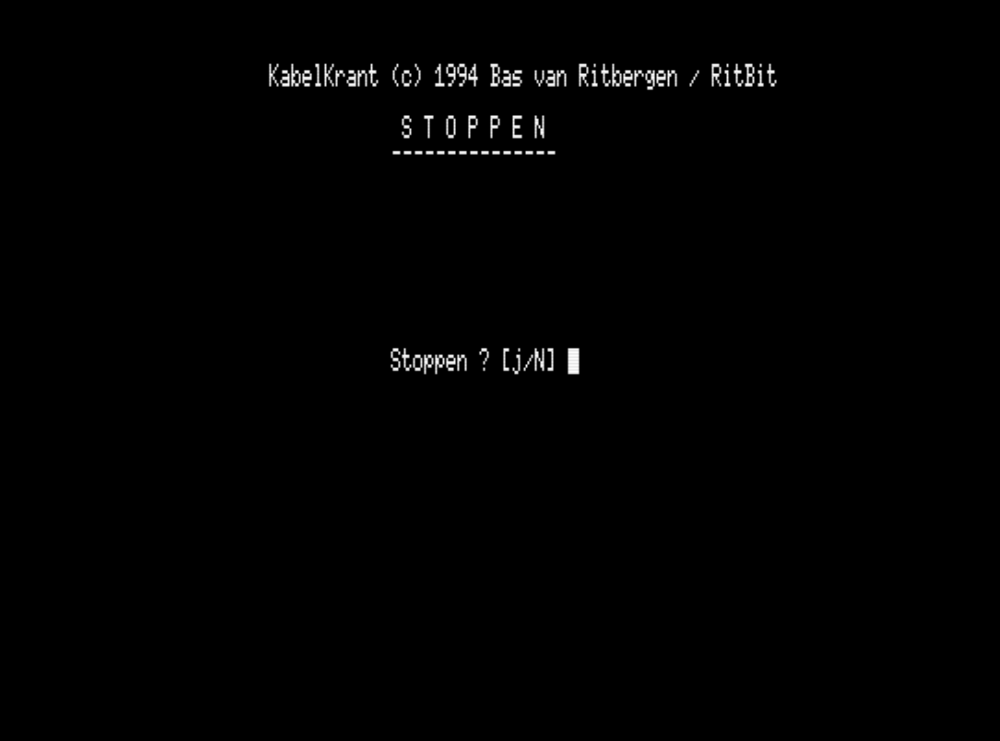
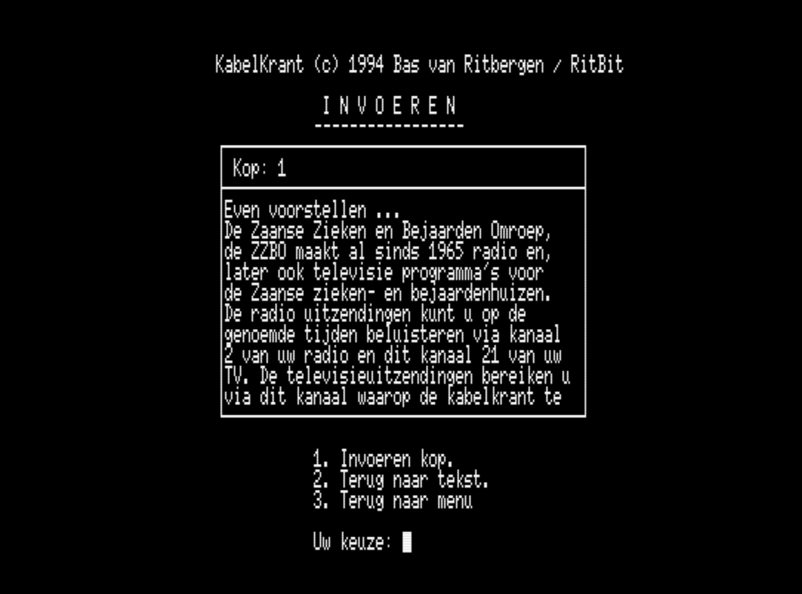

# Screenshots

All screenshots were captured from the version 6.2 source running in an MSX2 emulator.

Images are stored in `docs/images/`.

---

## Live display

### Startup / splash screen

The ZZBO Kabelkrant logo as displayed when the system boots. Loaded from `INTRO.SC7` (a SCREEN 7 VRAM dump). The large pixel-art lettering *"ZZBO"* and cursive *"kabelkrant"* in yellow are the graphical identity of the service.

---

### Information page (live)

A live information page during the broadcast loop.

Key elements visible:

- **Top bar** — alternates between *"Kabelkrant"* and the current date
- **Page counter** — *"1/22"* (current page / total pages for the day)
- **Analog clock** — top right, drawn by the interval timer routine, hands from precomputed `XK.DAT` / `YK.DAT` coordinates
- **Page title** — *"Even voorstellen ..."* rendered with the proportional font in yellow
- **Body text** — 10 lines of proportional font text on grey background strips
- **Play icon** (▶) — the page type pictogram (type 1: arrow/general info)
- **Hourglass icon** — animated during page display to indicate remaining display time

---

## Graphics asset sheet

### KRANT4.SC7 virtual page

The complete KRANT4.SC7 VRAM asset sheet, as viewed using *"Virtuele videopagina tonen"* in UTILS.SYS.

Contents (top to bottom, left to right):

- **Row 1 (icons, Y=0–15):** 10 page-type pictograms: ▶ (pijltje), TV (teeveetje), road (radiootje), house (huisje), letter (briefje), cutlery (bord en bestek), exclamation (uitroepteken), heart (hartje), scissors+comb (schaar en kam), plants (bloemen en planten) — then digits 0–9
- **Row 2 (Y=16–48):** Hourglass animation frames and hourglass-related graphics
- **Row 3 (body font, Y=49–81 approx.):** Font style `LT=1` — body text (small)
- **Row 4 (Y=82–99 approx.):** Font style `LT=2` — secondary text
- **Row 5 (Y=100–120 approx.):** Font style `LT=3` — title/header text (medium, used in headers)
- **Row 6 (Y=160+ approx.):** Font style `LT=4` — additional font variant

The exact Y boundaries are loaded from the metadata table in `LOOP.SYS` lines 2810–2840.

---

### KRANT3.SC7

The KRANT3.SC7 screen asset. Used for the background frame and certain graphical elements.

---

## Operator menus

### Main menu (HOOFDMENU)

The main operator menu displayed in SCREEN 0 (80-column text mode). Accessed by pressing space during the live display.

Options:

1. Stoppen — exit to display loop
2. Teksten — text editor (`TEKST.SYS`)
3. Krant — page schedule editor (`KRANT.SYS`)
4. Systeem instellingen — system settings (`SYSTEM.SYS`)
5. Systeem utillities — utilities (`UTILS.SYS`)

---

### Stop confirmation

The confirmation screen before exiting the operator menu back to the display loop.

---

## Text editing (TEKST.SYS)

### Text menu

The text editor sub-menu.

---

### Text input screen

Text entry — selecting a page file to edit.

---

### Text editor

The full-screen text editor. Edits a `.TXT` page file directly. The top field shows the page type number (*"Kop: 1"*), followed by the page title and up to 10 body lines.

---

### Text overview

Overview of all text files on the disk.

---

### Load text

Text file load screen.

---

### Delete text

Text file deletion confirmation.

---

## Page schedule (KRANT.SYS)

### Krant menu

The page schedule management menu.

---

### Page schedule — compose

The page schedule composition screen. The grid shows 32 page slots for the selected day. The bottom panel lists all available page files by number. The operator enters a file number to assign it to a slot.

---

### Page schedule — edit

Editing an existing page schedule.

---

### Day schedule — load

Loading the page schedule for a specific day from `KRANT.PAG`.

---

### Day schedule — save

Saving the page schedule for a specific day back to `KRANT.PAG`.

---

### Close / exit schedule

Exiting the page schedule editor.

---

## System settings (SYSTEM.SYS)

### System settings menu

The system settings menu. Options include:

- Tijd wijzigen (change clock time)
- Datum wijzigen (change date)
- Zomertijd / Wintertijd (summer/winter time)
- Ctrl-Stop instelling (enable/disable Ctrl-Stop key)

---

### Change time

Setting the system clock via `SET TIME`.

---

## Utilities (UTILS.SYS)

### Utilities menu

The utilities menu. Options include text overview, text rename, text delete, view virtual page, and the "Storing!" fault display.

---

## Fault screen

### Storing (technical fault display)

The fault/maintenance screen (`STORING.SC7`). Displayed when the broadcast is interrupted for maintenance. Shows the ZZBO logo with the message *"Vanwege technische werkzaamheden is er momenteel geen ZZBO kabelkrant. Onze excuses hiervoor."* (Due to technical maintenance there is currently no ZZBO kabelkrant. Our apologies.)

Can be triggered from `UTILS.SYS` → "Storing!".
