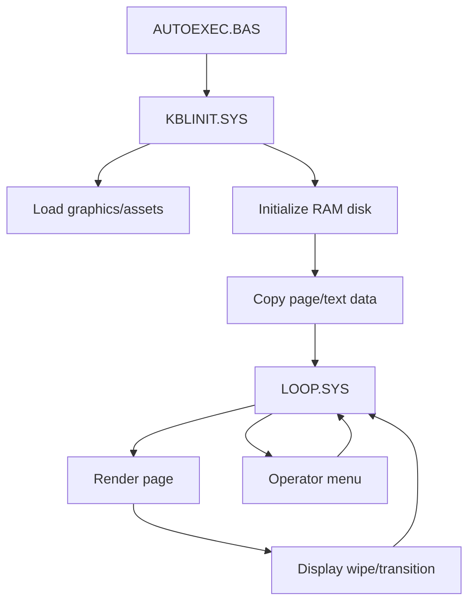

# Software Overview

Kabelkrant-MSX2 is a digital bulletin board system for MSX2.

It presents a sequence of information pages on a television output. Pages are built from text files, screen assets and menu/page configuration files. The system was intended to run unattended for long periods.

## Main responsibilities

The software handles:

- startup and initialization
- loading assets
- preparing a RAM disk
- reading page definitions
- rendering text pages
- displaying transitions and wipes
- allowing operator/editor interaction
- returning to the display loop

## Major program areas

Typical files in the original system include:

- `AUTOEXEC.BAS` — boot/startup entry point
- `KBLINIT.SYS` — initialization
- `LOOP.SYS` — main display loop
- `MAIN.SYS` — operator/menu handling
- `TEKST.SYS` — text editing or text-related functions
- `KRANT.SYS` — newspaper/page handling
- `SYSTEM.SYS` and `UTILS.SYS` — support routines
- `RAMDISK.BIN` — binary RAM disk support

Exact file roles should be verified against the original source.

## Runtime concept

## Output

The system targets the MSX2 video hardware and produces a television-compatible graphical output suitable for distribution over a local TV network.
