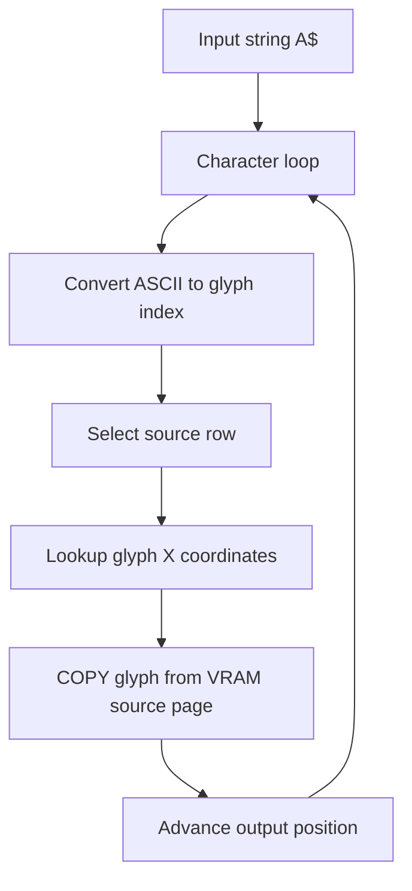

# Text Engine

The text engine is implemented in BASIC inside `LOOP.SYS`.

## Core idea

The system does not rely on MSX text mode. It uses graphical font data in SCREEN 7 and copies glyphs using MSX2 graphics commands.

## Inputs

The text routine uses shared BASIC variables:

| Variable | Meaning |
|----------|---------|
| `A$` | string to render |
| `X` | destination X coordinate |
| `Y` | destination Y coordinate |
| `LT` | font/letter type selector |
| `K` | colour/mask parameter |

## Rendering algorithm

## Proportional spacing

The renderer uses glyph metric data (`X.DAT`) and font metadata arrays to determine source glyph width.

## Alignment trick

When `X` is negative, the routine renders to a scratch area first, measures the resulting width, then copies the final line to the visible page with adjusted coordinates. This makes proportional centred/right-aligned text possible in BASIC.

---

## See also

- [internal/TEXT-ENGINE.md](internal/TEXT-ENGINE.md) — detailed source analysis with BASIC code excerpts
- [RENDERING.md](RENDERING.md) — full rendering pipeline including font metrics, VRAM layout, and all glyph operations
- [FILE-FORMATS.md](FILE-FORMATS.md) — X.DAT, XK.DAT, YK.DAT metric file formats
