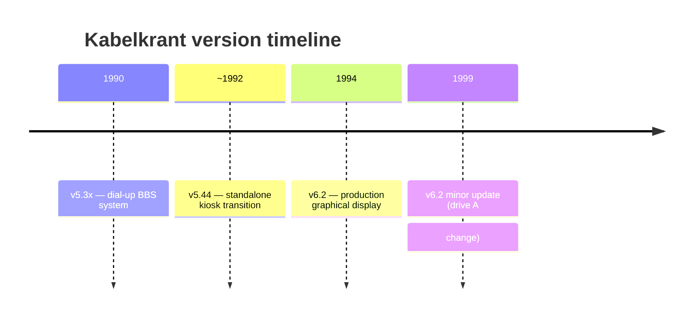

# Version History

Three generations of the Kabelkrant software are preserved in this repository.



---

## Version 5.3x (c. 1990)

**Location:** `archive/5.3x/`

The earliest preserved generation. Copyright line: *"KabelKrant (c) 1990 by RitBit Software Inc."*

This version was a **dial-up BBS** combined with the kabelkrant display. Editors and system operators could telephone into the machine over a modem to read and update content remotely.

### Key files

| File | Purpose |
|---|---|
| `AUTOEXEC.BAS` | Minimal boot, loads RAM disk |
| `LOGIN.SYS` | User login: username + password, access levels |
| `LOGOFF.SYS` | User logoff, session cleanup |
| `MDMBASIC.BIN` | Modem support binary |
| `MAIN.SYS` | Operator/BBS main menu (very large: 6680 bytes) |
| `SYSTEM.SYS` | System settings (very large: 13776 bytes) |
| `KRANT.SYS` | Page/newspaper management |
| `TEKST-M.SYS` | Text module M |
| `TEKST-T.SYS` | Text module T |
| `LOOP.SYS` | Display loop (11792 bytes) |
| `KBLINIT.SYS` | Initialisation |
| `RAMDISK.BIN` | RAM disk driver |
| `LOGO!.SC7` | Intro screen graphic |
| `MAINPAGE.SC7` | Main display graphic |
| `USER.DTA` | User account database |
| `REQUEST.DTA` | Request data |
| `COMMENTS.DTA` | Comment data |
| `LOG.DTA` | Session log |
| `ZZBO.DTA` | ZZBO-specific data |

### Access levels

The login system supported multiple access levels:

| Level | Description |
|---|---|
| 0 | Deleted / disabled account |
| 1 | Not yet registered |
| 2 | Medewerker (staff) |
| 3 | Redactie Kabelkrant (editorial staff) |
| 4 | System operator |

### Main menu (v5.3x)

```text
1. Stoppen
2. Teksten
3. Krant
4. Grafisch (nog niet mogenlijk)       <- planned, never implemented
5. VHS programma (nog niet mogenlijk)  <- planned, never implemented
6. Systeem
```

The "Grafisch" and "VHS programma" entries show planned but unimplemented features of the v5.3x era.

---

## Version 5.44 (intermediate, c. 1992)

**Location:** `archive/5.44/`

An intermediate version that removed all BBS and modem infrastructure. The system became a local kiosk only.

### Key changes from v5.3x

- `LOGIN.SYS` / `LOGOFF.SYS` removed — no user authentication
- `MDMBASIC.BIN` removed — no modem support
- `USER.DTA`, `LOG.DTA`, `REQUEST.DTA`, `COMMENTS.DTA` removed
- `TEKST-M.SYS` / `TEKST-T.SYS` → merged into a single `TEKST.SYS`
- `MAIN.SYS` shrank dramatically (from 6680 bytes to 1436 bytes)
- `SYSTEM.SYS` shrank dramatically (from 13776 bytes to 4934 bytes)
- `LOOP.SYS` is 9763 bytes (smaller than v6.2's 13950 — more features were added later)
- `STORING.BAS` replaces the graphical fault screen (text-only maintenance notice)
- Still uses `MAINPAGE.SC7` as the primary graphic asset (the split KRANT3/4.SC7 came later)
- No `UTILS.SYS` or `PAPER.SYS` yet

The `AUTOEXEC.BAS` is notably minimal (5 lines of line-numbered BASIC without header comments), suggesting early-stage reorganisation.

---

## Version 6.2 (1994)

**Location:** `src/`

The production version. File headers are dated between **03-01-1994** and **08-07-1994**. The copyright reads *"Kabelkrant (c) 1994 Bas van Ritbergen / RitBit"*.

### Key changes from v5.44

- Display system is fully graphical: SCREEN 7 throughout the live display
- Font and icon asset sheet split into `KRANT3.SC7` + `KRANT4.SC7`
- `STORING.SC7` — graphical fault screen replaces `STORING.BAS`
- `UTILS.SYS` added — text overview, rename, delete, virtual page view
- `PAPER.SYS` added — paper/schedule related utilities
- `HEADER.SYS` added — shared header include
- `LOOP.SYS` grew to 13950 bytes (rendering pipeline, 14 wipe effects, clock, hourglass)
- Proportional font engine with glyph metrics from `X.DAT`, `XK.DAT`, `YK.DAT`
- 14 named wipe transitions between pages
- Animated hourglass during page display
- `AUTOEXEC.BAS` gained header comments and Ctrl-Stop configuration
- KBLINIT.SYS embeds three USR assembly routines (uppercase, strip spaces)

### Source file headers (v6.2)

| File | Date | Function |
|---|---|---|
| `AUTOEXEC.BAS` | 06-06-1994 | Autostart of kabelkrant |
| `KBLINIT.SYS` | 08-07-1994 | Initialise RAM and VRAM areas |
| `LOOP.SYS` | 08-07-1994 | Generate kabelkrant display |
| `MAIN.SYS` | 03-01-1994 | Process system functions |
| `KRANT.SYS` | 03-01-1994 | Process system functions (page management) |
| `TEKST.SYS` | 03-01-1994 | Text editor |
| `SYSTEM.SYS` | 04-05-1994 | Change system setup |
| `UTILS.SYS` | 13-06-1994 | Utilities for Kabelkrant V6.2 |
| `PAPER.SYS` | 31-06-1994 | Make a paper for Kabelkrant V6.0 |

### The 1999 update

Two source comments in `LOOP.SYS` and `KBLINIT.SYS` note a small change made in **1999**:

```text
1999: Changed line 230 to A: drive
1999: Changed line 3960 to A: Drive
1999: Changed line 3940 to EXT$=".txt"
```

This indicates the system was still in active use five years after the last major development, and a minor maintenance update was applied to change disk drive references.

---

## Version comparison

| Feature | v5.3x | v5.44 | v6.2 |
|---|---|---|---|
| Dial-up BBS / modem | Yes | No | No |
| User login system | Yes | No | No |
| Session logging | Yes | No | No |
| Graphical live display | Partial | Partial | Full (SCREEN 7) |
| Proportional font engine | No | No | Yes |
| Wipe transitions | Unknown | Unknown | 14 named effects |
| Animated clock | Unknown | Unknown | Yes (interval-driven) |
| Animated hourglass | No | No | Yes |
| RAM disk (drive C:) | Yes | Yes | Yes |
| UTILS.SYS | No | No | Yes |
| Graphical fault screen | No | No | Yes (STORING.SC7) |
| Source headers / dates | 1990 | undated | 1994 |
