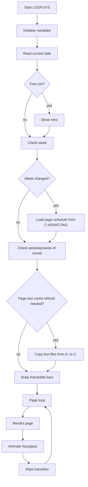

# Display Loop: LOOP.SYS

`LOOP.SYS` is the main presentation engine.

## Source identity

The file header identifies it as:

```text
Name      : LOOP.SYS
Date      : 08-07-1994
Function  : Generates kabelkrant
Part of   : Kabelkrant V6.2
Chains to : MAIN.SYS
Options   : Chains by pressing space-bar.
```

The source also contains later 1999 comments about drive/path changes.

## High-level loop

The program starts by setting up BASIC runtime behaviour:

- Ctrl-Stop handling
- integer defaults
- double precision for X/Y variables
- STOP handler
- joystick/trigger handler
- interval timer handler for the clock

Then it runs this control sequence:

```text
GOSUB 1000  initialise variables
GOSUB 1200  determine date/week/day
GOSUB 1500  intro, once at startup
GOSUB 1400  load weekly page table if week changed
GOSUB 3900  copy page text files to RAM disk if week-of-month changed
GOSUB 2000  clear/wipe screen and draw title bars
GOSUB 2200  page display loop
```

## Main presentation cycle



## Page schedule

The weekly page schedule is loaded from `C:KRANT.PAG`.

The file is opened as a random-access file with record length 256. Each record is split into two 128-byte fields, each holding sixteen 8-character page names. This yields up to 32 page entries for one day/week selector.

Blank or unused page slots are represented by either leading spaces or the marker:

```text
--------
```

## Text file rendering

For each active page, the loop opens:

```basic
"C:" + N$(PG) + ".TXT"
```

Each page file is expected to contain:

1. A page/icon type number.
2. A page title/header line.
3. Up to ten body text lines.

The first line selects the icon copied from `KRANT4.SC7`.

The title and body lines are passed to the custom proportional text routine at `GOSUB 2500`.

## Text rendering routine

The renderer at `GOSUB 2500` uses:

- `A$` as the text to render
- `X`, `Y` as destination coordinates
- `LT` as font/type selector
- `K` as colour/mask parameter

If `X` is negative, the routine renders into a scratch area on hidden page 1, computes the final width, then copies the result aligned to the absolute X coordinate.

This is how centered/right-aligned text-like placement is achieved in BASIC.

## Clock

The interval timer calls the clock routine around line 2900. It draws analog clock hands using coordinates loaded from `XK.DAT` and `YK.DAT`.

The clock is disabled around slow rendering/wipe operations using `INTERVAL OFF` and re-enabled afterwards.

## Wipes

The routine around line 3100 selects one of 14 wipe effects using `RND(1)`. The wipes are BASIC `LINE`/`COPY` animations that clear the page area in different geometric patterns.

The wipe region is documented in the source as running roughly from line 48 to 212 and horizontally across the 512-pixel SCREEN 7 width.

## Operator escape

The file header says it chains to `MAIN.SYS` by pressing space. The runtime also has STOP and trigger handlers. The handler around line 4070 returns to text mode and runs:

```basic
RUN "main.sys"
```

## Important data files used

- `C:KRANT.PAG`
- `C:<page>.TXT`
- `A:<page>.txt`
- `XK.DAT`
- `YK.DAT`
- `X.DAT`
- `KRANT4.SC7`
- `INTRO.SC7`

## Engineering notes

`LOOP.SYS` is performance-critical. The slow paths are visible in the source: proportional text rendering, page wipes and repeated graphical operations. Disk I/O is mitigated by the RAM disk, while rendering remains mostly BASIC-driven.
