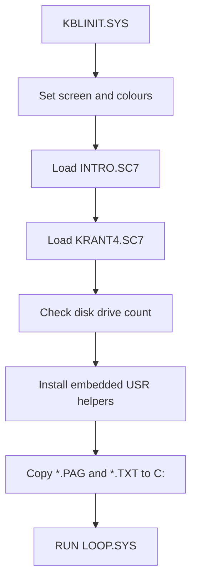

# Initialisation: KBLINIT.SYS

`KBLINIT.SYS` prepares the visual environment, RAM disk contents and support routines before starting the presentation loop.

## Source identity

The file header identifies it as:

```text
Name      : KBLINIT.SYS
Date      : 08-07-1994
Function  : initializes the ram/vram areas of Kabelkrant and setups system
Part of   : Kabelkrant V6.2
Chains to : LOOP.SYS
```

A later source comment notes a 1999 change involving the `A:` drive.

## Main responsibilities

`KBLINIT.SYS` performs these actions:

1. Sets display colours and disables sprites.
2. Switches between SCREEN 0 and SCREEN 7.
3. Loads the intro screen image.
4. Copies screen regions in VRAM.
5. Loads `KRANT4.SC7`, which contains the main graphics/font assets.
6. Checks the number of connected disk drives.
7. Installs three small Z80 `USR` routines from embedded DATA statements.
8. Copies page/text data to RAM disk drive `C:`.
9. Starts `LOOP.SYS`.

## Embedded USR routines

The source includes this comment:

```text
Code for 3 USR functions, 0 = Upcase, 1 = strip spaces, 2 = 0 + 1
```

The machine code is loaded by reading hex byte strings from DATA statements and poking them into memory around `&HF975`.

The installed BASIC entry points are:

```basic
DEFUSR  = AD
DEFUSR2 = AD+11
DEFUSR1 = AD+25
```

The naming/order is historical and should be documented carefully if analysed further.

## RAM disk population

After the USR routines are installed, the program reads filename patterns from DATA:

```text
*.PAG
END
*.TXT
```

It copies matching files from drive `A:` to drive `C:`.

Drive `C:` is expected to be the RAM disk created earlier by `RAMDISK.BIN`.

## Error strategy

Missing files are handled leniently. If an error 53 occurs while copying files, the program resumes and continues. Other errors fall through to a warning/error screen.

## Initialisation flow



## Notes

`KBLINIT.SYS` is the bridge between the boot-time RAM disk installer and the normal running system. Once it finishes, the program is expected to operate primarily from cached files on the RAM disk.
