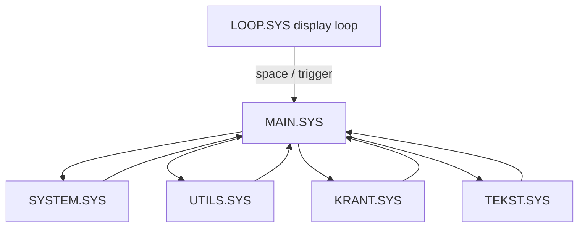

# Operator Menus

The system includes operator-facing modules for maintaining the newspaper and system settings.

## MAIN.SYS

`MAIN.SYS` is identified as the main dispatcher for system functions. Its header states that it chains to:

```text
UTILS.SYS
SYSTEM.SYS
KRANT.SYS
TEKST.SYS
```

It acts as the central menu for operator tasks.

## SYSTEM.SYS

`SYSTEM.SYS` handles system setup tasks.

Visible menu options include:

- Hoofdmenu
- Tijd wijzigen
- Datum wijzigen
- Zomertijd instellen
- Wintertijd instellen
- Ctrl-Stop instellen

The module includes shared input routines and calls MSX BASIC date/time functions such as:

```basic
GET DATE
GET TIME
SET DATE
SET TIME
```

## UTILS.SYS

`UTILS.SYS` contains utility functions.

Visible menu options include:

- Hoofdmenu
- Tekst overzicht
- Tekst wissen
- Tekst hernoemen
- Virtuele videopagina tonen
- Storing!

It can display `STORING.SC7` as a fault/maintenance page.

## KRANT.SYS

`KRANT.SYS` manages newspaper/page composition.

Visible menu options include:

- Hoofdmenu
- Samenstellen
- Wijzigen
- Opslaan
- Laden
- Krant lezen

It is responsible for editing and saving the page schedule stored in `KRANT.PAG`.

## TEKST.SYS

`TEKST.SYS` is the text editor module.

Visible menu options include:

- Hoofdmenu
- Tekst verwerker
- Bewaren
- Laden

This module is responsible for maintaining the `.TXT` page content used by the presentation loop.

## Operator flow



## Shared patterns

The operator modules use similar menu structure:

- clear screen
- print copyright/header line
- show numbered menu choices
- read one key with `INPUT$(1)`
- dispatch using `ON ... GOTO` or `ON ... GOSUB`
- return to `MAIN.SYS`
